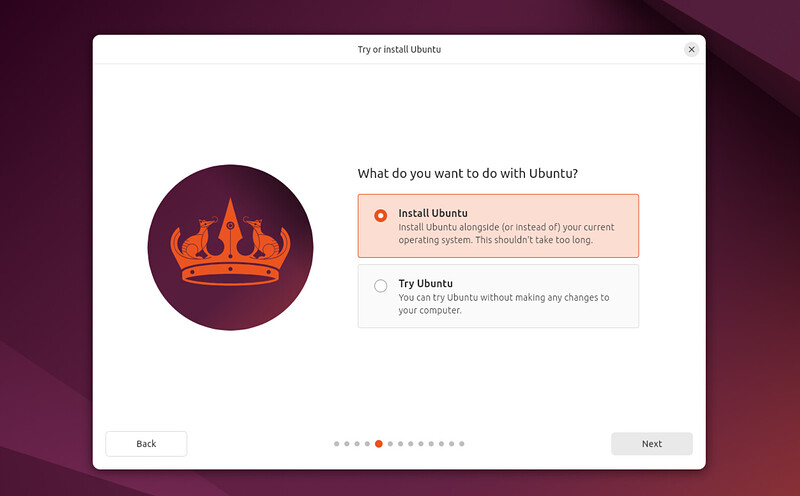
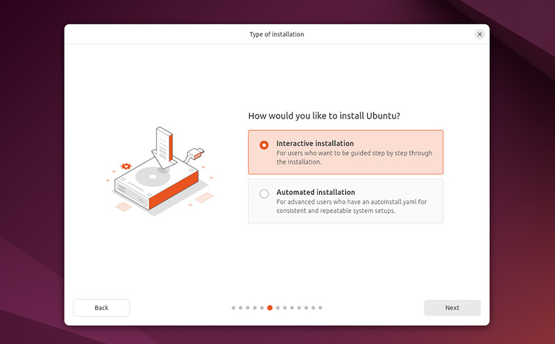
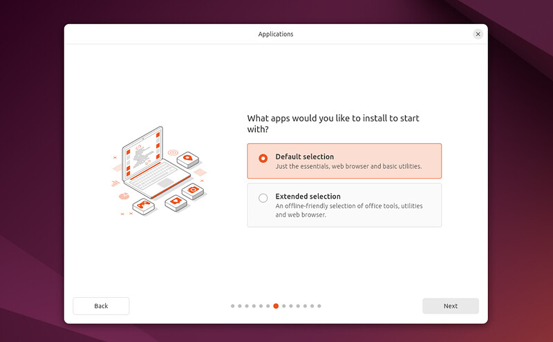
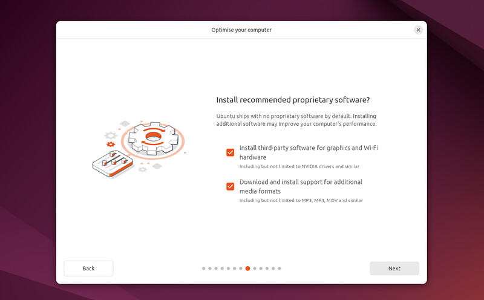
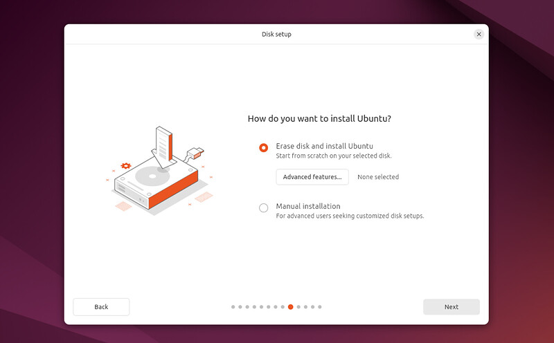
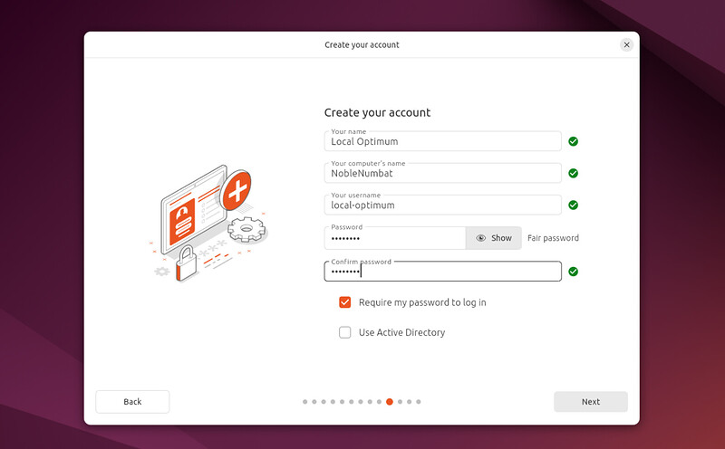
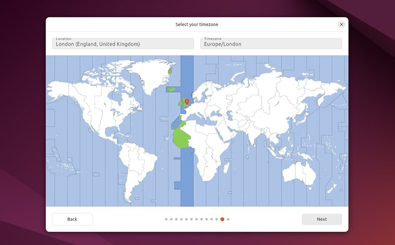

# How to install Ubuntu Desktop for developers

Ubuntu desktop is an open-source operating system designed for a range of tasks including development. In this guide, you will install Ubuntu Desktop as a platform for your software development environment.

:::
### Prerequisites
:::

Before you can install Ubuntu Desktop, you need to make sure you have:

- A laptop or PC with at least 256GB of storage. It is recommended that you install Ubuntu on a device listed on the [Ubuntu-certified hardware](https://ubuntu.com/certified?q=&limit=20&category=Desktop&category=Laptop) page.
- A USB stick with at least 12 GB of free space.

## Preparing for installation

You can install Ubuntu desktop as: 

- The only operating system (OS) on your device (single boot), which is ideal if you run resource-intensive tasks requiring full hardware utilization.
- Along with another OS (dual boot), which is ideal if you need Ubuntu OSes for only specific tasks.
- Run it inside another OS using virtualization software, ideal for testing Ubuntu without affecting your main system. Follow [this guide](https://ubuntu.com/tutorials/how-to-run-ubuntu-desktop-on-a-virtual-machine-using-virtualbox#1-overview) to install Ubuntu as a VM.

Whichever mode you choose to install Ubuntu desktop as, you can choose to run it in GUI (with a user interface) or headless mode (without a user interface). For a developer environment, you will install Ubuntu desktop as a single boot with a GUI. 

To achieve this, download the ISO file for the [latest version of Ubuntu desktop](https://www.ubuntu.com/download). Then, create a bootable USB stick using tools for flashing OS images onto storage devices like [balenaEtcher](https://etcher.balena.io/).

## Installing Ubuntu desktop

Follow the steps below to install Ubuntu desktop.

### Initializing the installation

Insert the bootable USB stick into the device you want to install Ubuntu desktop and boot or restart the device. It should detect the bootable ISO during the boot process and initialize the installer.

:::{note}

Hold F12 during startup and select the USB device from the system-specific boot menu if your device does not detect the bootable ISO. Alternatively, look for a brief message that informs you which key to press to bring up the boot menu when your system starts.

:::

Once the installer is initialised, you will be required to **choose your preferred language**, select the **accessibility settings** you require, **choose your keyboard layout**, and connect to the Internet for your installation. 

### Initiating the installation process

On the next screen, you will be provided with the option to **Try Ubuntu**, which allows you to preview Ubuntu without making any changes to your PC, or to **Install Ubuntu**, which allows you to install Ubuntu with or instead of your current operating system.

<aside>

If your system uses Intel’s Rapid Storage Technology, you must disable it to continue with the installation. Visit [help.ubuntu.com/rst](https://help.ubuntu.com/rst/) for more information.

</aside>

### Choosing installation process

On the installation setup screen, you can choose between **Interactive installation** and **Automated Installation**. Choose the **Interactive installation** option, which is the standard installation option. 

However, you can choose the **Automated Installation** option if you have a configuration file to standardize your installation. You can get more information about automated installation [here](https://blog.local-optimum.net/getting-started-with-autoinstall-on-ubuntu-desktop-24-04-lts-147a1defb2de). 

### Choosing starter apps

Next, you will be prompted to choose the apps you would like to start the install with. You can choose the **Default selection** to proceed with essential apps like web browsers or the **Extended selection** to install office tools and utilities.

### Installing third-party software

Next, you will be prompted to install third-party software for graphics and hardware and to support additional media formats. To get the best performance out of your installation, tick all the boxes.

### Choosing the Ubuntu installation type

On the next screen, select **Erase disk and install Ubuntu** if you want to install Ubuntu as the only OS on your device. Select Manual installation to install Ubuntu as a secondary OS on your system. Instructions on how to install Ubuntu as a secondary OS can be found [here](https://ubuntu.com/tutorials/install-ubuntu-desktop#installing-ubuntu-alongside-another-operating-system).

### Creating login details

On the next screen, you will be prompted to enter your name and the name of your system and create a username and password. 

On this page, there are two other options you can enable:

- **Require my password to log in**: You should enable this option to prevent unauthorized access.
- **Use Active Directory**: This option allows you to link your system to an existing Active Directory domain, allowing you to log in with your domain account after installation. Learn how to join an Active Directory using [this guide](https://documentation.ubuntu.com/adsys/en/stable/how-to/join-ad-installation/#join-at-installation-time).

### Final installation steps

On the next page, you will be required to select your location and timezone. If you are connected to the Internet, they will be automatically detected.

The next page will summarise the installation options you chose to confirm your setup before proceeding with the installation process. If everything looks okay, proceed with the installation, else go back and modify the options you are not satisified with.

## Post Installation Recommendations

Welcome to Ubuntu!! Be sure to keep your system up to date to receive the latest updates and security patches. You can automate this process by [enabling automatic updates](https://www.kolide.com/features/checks/ubuntu-unattended-upgrades).

Now that you have installed Ubuntu desktop, you can take your developer workspace to the next level by installing and configuring a version control system like Git.