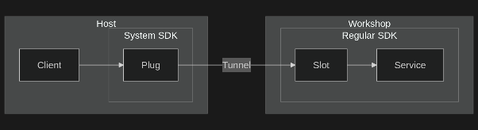

---
myst:
  html_meta:
    description: 'Use the Java Workshop SDKs to build and run a Java application on Ubuntu.'
---

(java-workshop-sdks)=
# Develop with Java Workshop SDKs on Ubuntu

This tutorial provides basic guidance on using the Java Workshop SDKs for development environments on Ubuntu with the [Workshop](https://ubuntu.com/workshop) tool. It shows how to create a "Hello, World!" program, explains how to build projects using Gradle or Maven, and goes in-depth with an example using the `petclinic` application.

For instructions on how to install Workshop and related tooling, see the dedicated guide on how to [Get started with workshops](https://ubuntu.com/workshop/docs/). This article assumes that the suggested tooling has been installed. There is no need to install Java or related tooling, as they are installed through the examples process.


## Currently supported Java Workshop SDKs

The following Workshop SDKs are available for the Java ecosystem:

| SDK Name                                              | Versions       | Description                            |
| :---------------------------------------------------- | :------------- | :------------------------------------- |
| [`openjdk`](https://github.com/canonical/openjdk-sdk) | 17, 21, and 25 | Open-source Java Development Kit (JDK) |
| [`maven`](https://github.com/canonical/maven-sdk)     | 3.9            | Apache Maven build tool                |
| [`gradle`](https://github.com/canonical/gradle-sdk)   | 8 and 9        | Gradle build tool                      |


## Getting started with Java Workshop SDKs

To get started using these SDKs, [install Workshop and its prerequisites](https://ubuntu.com/workshop/docs/tutorial/part-1-get-started/) to make sure it runs:

```{terminal}
:copy:
:user: dev
:host: ubuntu

sudo snap install --channel=6/stable lxd
```

```{terminal}
:copy:
:user: dev
:host: ubuntu

sudo snap install --classic workshop
```

Before initializing a workshop, search the SDK Store to confirm that the SDKs exist and get information about the publisher and the available versions.

* Confirm/search for available SDKs:

    ```{terminal}
    :copy:
    :user: dev
    :host: ubuntu

    sdk find openjdk
    ```

* Inspect SDK release information:

    ```{terminal}
    :copy:
    :user: dev
    :host: ubuntu

    sdk info openjdk
    ```


## Creating a Java Workshop using OpenJDK

Compile a Java application directly using tools from the {pkg}`openjdk` workshop SDK.

:::
### Prerequisites
:::

- [Install Workshop and its prerequisites](https://ubuntu.com/workshop/docs/tutorial/part-1-get-started/)


:::
### Procedure
:::

1. Initialize the applications workshop definition with the {pkg}`openjdk` SDK:

    ```{terminal}
    :copy:
    :user: dev
    :host: ubuntu

    workshop init openjdk-example --sdks openjdk/21/stable
    ```

    This command writes the definition to the {file}`.workshop/openjdk-example.yaml` file with the {pkg}`openjdk` SDK pinned to the `21/stable` channel.

    ```{code-block} yaml
    :caption: `.workshop/openjdk-example.yaml`

    name: openjdk-example
    base: ubuntu@24.04
    sdks:
      - name: openjdk
        channel: 21/stable
    ```

    :::{note}
    The choice of `openjdk-example` as the name of the workshop here is arbitrary; however, it could reflect the expected environment context. For example, a project could have development, production, and testing workshop definitions to sandbox internal and external release environments whilst keeping them replicable for all users.
    :::

1. Create a "Hello, World!" application in a file named {file}`App.java`:

    ```{code-block} java
    :caption: `App.java`

    public class App {
        public String getGreeting() {
            return "Hello, World!";
        }

        public static void main(String[] args) {
            System.out.println(new App().getGreeting());
        }
    }
    ```

1. To get the workshop ready for use, launch it and confirm the runtime information matches the definition file:

   1. Prepare workshop after initialization:

      ```{terminal}
      :copy:
      :user: dev
      :host: ubuntu

      workshop launch openjdk-example
      ```

   1. View information about the workshop:

      ```{terminal}
      :copy:
      :user: dev
      :host: ubuntu

      workshop info openjdk-example
      ```

      This prepares the workshop by automatically pulling and installing the defined SDKs, after which it starts the workshop container. If any changes are made to the {file}`.workshop/openjdk-example.yaml` file, the workshop can be refreshed using the {command}`workshop refresh` command.

      :::{note}
      To stop the workshop environment from running, use {command}`workshop stop`. To then make the workshop ready for use again, start it with the {command}`workshop start` command.
      :::

1. Compile the class file in the `out` directory within the workshop:

    ```{terminal}
    :copy:
    :user: dev
    :host: ubuntu

    workshop exec openjdk-example -- javac App.java -d out
    ```

1. Execute the compiled program from within the workshop:

    ```{terminal}
    :copy:
    :user: dev
    :host: ubuntu

    workshop exec openjdk-example -- java -cp out App
    ```

    This prints "Hello, World!" to the workshop console.


## Creating a Java Workshop using Maven

Set up and build a new Java project using the {pkg}`maven` workshop SDK.


:::
### Prerequisites
:::

- [Install Workshop and its prerequisites](https://ubuntu.com/workshop/docs/tutorial/part-1-get-started/)


:::
### Procedure
:::

1. Initialize the applications workshop definition with the {pkg}`openjdk` and {pkg}`maven` SDKs:

    ```{terminal}
    :copy:
    :user: dev
    :host: ubuntu

    workshop init maven-example --sdks openjdk/21/stable,maven/3.9/stable
    ```

    This command writes the definition to the {file}`.workshop/maven-example.yaml` file with the SDKs pinned to their respective channels.

    ```{code-block} yaml
    :caption: `.workshop/maven-example.yaml`

    name: maven-example
    base: ubuntu@24.04
    sdks:
      - name: openjdk
        channel: 21/stable
      - name: maven
        channel: 3.9/stable
    ```

1. To get the workshop ready for use, launch it and confirm the runtime information matches the definition file:

   1. Prepare workshop after initialization:

      ```{terminal}
      :copy:
      :user: dev
      :host: ubuntu

      workshop launch maven-example
      ```

   1. View information about the workshop:

      ```{terminal}
      :copy:
      :user: dev
      :host: ubuntu

      workshop info maven-example
      ```

1. Enter the workshop using the {command}`workshop exec` command:

    ```{terminal}
    :copy:
    :user: dev
    :host: ubuntu

    workshop exec maven-example bash
    ```

1. Create a new Java project using the {command}`archetype:generate` Maven sub-command from within the workshop:

    ```{terminal}
    :copy:
    :user: dev
    :host: ubuntu

    mvn archetype:generate -DgroupId=com.yourcompany \
        -DartifactId=helloworld -Dversion=1.0-SNAPSHOT \
        -Dpackage=com.yourcompany.helloworld \
        -DarchetypeGroupId=org.apache.maven.archetypes \
        -DarchetypeArtifactId=maven-archetype-quickstart \
        -DarchetypeVersion=1.4
    ```

    Press {kbd}`Enter` when prompted to confirm your selection. This creates a new project using the [Maven Quickstart Archetype](https://maven.apache.org/archetypes/maven-archetype-quickstart/) and sets up a basic project structure that is replicated between the workshop environment and your host directory.

1. Change to the project directory and package the application:

    ```{terminal}
    :copy:
    :user: dev
    :host: ubuntu

    cd helloworld
    ```

    ```{terminal}
    :copy:
    :user: dev
    :host: ubuntu
    :dir: ~/helloworld

    mvn -Dmaven.compiler.release=8 package
    ```


## Creating a Java Workshop using Gradle

Set up and build a new Java project using the {pkg}`gradle` workshop SDK.


:::
### Prerequisites
:::

- [Install Workshop and its prerequisites](https://ubuntu.com/workshop/docs/tutorial/part-1-get-started/)


:::
### Procedure
:::

1. Initialize the applications workshop definition with the {pkg}`openjdk` and {pkg}`gradle` SDKs:

    ```{terminal}
    :copy:
    :user: dev
    :host: ubuntu

    workshop init gradle-example --sdks openjdk/21/stable,gradle/9/stable
    ```

    This command writes the definition to the {file}`.workshop/gradle-example.yaml` file with the SDKs pinned to their respective channels.

    ```{code-block} yaml
    :caption: `.workshop/gradle-example.yaml`

    name: gradle-example
    base: ubuntu@24.04
    sdks:
      - name: openjdk
        channel: 21/stable
      - name: gradle
        channel: 9/stable
    ```

1. To get the workshop ready for use, launch it and confirm the runtime information matches the definition file:

   1. Prepare workshop after initialization:

      ```{terminal}
      :copy:
      :user: dev
      :host: ubuntu

      workshop launch gradle-example
      ```

   1. View information about the workshop:

      ```{terminal}
      :copy:
      :user: dev
      :host: ubuntu

      workshop info gradle-example
      ```

1. Enter the workshop using the {command}`workshop exec` command:

    ```{terminal}
    :copy:
    :user: dev
    :host: ubuntu

    workshop exec gradle-example bash
    ```

1. Create a new Java project using the {command}`gradle init` command from within the workshop:

    ```{terminal}
    :copy:
    :user: dev
    :host: ubuntu

    mkdir helloworld && cd helloworld
    ```

    ```{terminal}
    :copy:
    :user: dev
    :host: ubuntu
    :dir: ~/helloworld

    gradle init \
        --type java-application \
        --dsl kotlin \
        --test-framework junit-jupiter \
        --package com.yourcompany.helloworld \
        --project-name helloworld \
        --no-split-project \
        --no-incubating
    ```

    Press {kbd}`Enter` when prompted for the Java version. This creates a new project that includes a "Hello, World!" application and a unit test, mounted between the workshop environment and your host directory.

1. Change to the project directory to build and run the project using the generated Gradle wrapper:

    ```{terminal}
    :copy:
    :user: dev
    :host: ubuntu

    ./gradlew run
    ```


## Advanced example with `petclinic`

Set up and build the {file}`petclinic` sample application using the Java Workshop SDKs.


:::
### Prerequisites
:::

- [Install Workshop and its prerequisites](https://ubuntu.com/workshop/docs/tutorial/part-1-get-started/)


:::
### Procedure
:::

1. Initialize the `petclinic` project directory by cloning the target repository:

    ```{terminal}
    :copy:
    :user: dev
    :host: ubuntu

    git clone https://github.com/spring-projects/spring-petclinic.git
    ```

    ```{terminal}
    :copy:
    :user: dev
    :host: ubuntu

    cd spring-petclinic
    ```

1. Initialize the applications workshop definition with your choice of SDKs. For this example, use the {pkg}`openjdk` and {pkg}`maven` SDKs:

    ```{terminal}
    :copy:
    :user: dev
    :host: ubuntu

    workshop init petclinic-example --sdks openjdk/21/stable,maven/3.9/stable
    ```

    This command writes the definition to the {file}`.workshop/petclinic-example.yaml` file with the SDKs pinned to their respective channels.

1. Extend the {file}`.workshop/petclinic-example.yaml` configuration to include a slot and plug pair that exposes the application over the `localhost:8080` endpoint, and some actions to manage the application:

    ```{code-block} yaml
    :caption: `.workshop/petclinic-example.yaml`

    name: petclinic-example
    base: ubuntu@24.04
    sdks:
      - name: openjdk
        channel: 21/stable
      - name: maven
        channel: 3.9/stable
        slots:
          petclinic:
            interface: tunnel
            endpoint: localhost:8080
      - name: system
        plugs:
          petclinic:
            interface: tunnel
            endpoint: localhost:8080
    actions:
      build: mvn clean package    # Note: We use `mvn` over the `./mvnw` wrapper
      start: mvn spring-boot:run  # to use our custom defined channel version
    ```

    The plug and slot pair defined above are the interfaces that specify how to communicate and share resources. This allows each workshop to operate in its own isolated environment, whilst still allowing controlled interactions between the SDKs and the host. In our example, we first define a slot for Maven, which provides the capability to expose a desired network endpoint through the tunnel interface.

    Secondly, the example defines a tunnel plug that consumes the capability provided by the Maven slot. Since the plug is defined for the system SDK, this routes the Maven endpoint to the host endpoint and allows us to access the application from the host. This can be seen in the diagram below, where our interface pairing allows the client access to the application in the workshop.

    The following diagram shows the interface pairing that gives the client access to the application in the workshop:

    

1. After adding the changes above, launch the workshop and confirm that the runtime information matches the workshop definition:

   1. Prepare workshop after initialization:

      ```{terminal}
      :copy:
      :user: dev
      :host: ubuntu

      workshop launch petclinic-example
      ```

   1. View information about the workshop:

      ```{terminal}
      :copy:
      :user: dev
      :host: ubuntu

      workshop info petclinic-example
      ```

   1. And start the application using Maven:

      ```{terminal}
      :copy:
      :user: dev
      :host: ubuntu

      workshop run petclinic-example -- start
      ```

   Alternatively, execute commands directly inside the environment:

   ```{terminal}
   :copy:
   :user: dev
   :host: ubuntu

   workshop exec petclinic-example -- mvn clean package
   ```

   ```{terminal}
   :copy:
   :user: dev
   :host: ubuntu

   workshop exec petclinic-example -- ls -l target/*.jar
   ```

   Since we have exposed the application through the configured slot/plug pairing, we can then see the application in any browser on the host machine at the `http://localhost:8080` endpoint.

1. Modify the workshop definition to use {pkg}`gradle` instead of {pkg}`maven` by updating the actions to work with Gradle instead:

    ```{code-block} yaml
    :caption: `.workshop/petclinic-example.yaml`

    name: petclinic-example
    base: ubuntu@24.04
    sdks:
      - name: openjdk
        channel: 17/stable
      - name: gradle
        channel: 8/stable
        slots:
          petclinic:
            interface: tunnel
            endpoint: localhost:8080
      - name: system
        plugs:
          petclinic:
            interface: tunnel
            endpoint: localhost:8080
    actions:
      build: gradle build    # Note: We use 'gradle' over the './gradlew' wrapper
      start: gradle bootRun  # since we want to use our defined channel version
    ```

1. Refresh the workshop to now use the {pkg}`gradle` SDK instead of the {pkg}`maven` SDK:

   1. Refresh the environment with Gradle:

      ```{terminal}
      :copy:
      :user: dev
      :host: ubuntu

      workshop refresh petclinic-example
      ```

   1. Confirm that information has changed:

      ```{terminal}
      :copy:
      :user: dev
      :host: ubuntu

      workshop info petclinic-example
      ```

   1. And start the application using Gradle:

      ```{terminal}
      :copy:
      :user: dev
      :host: ubuntu

      workshop run petclinic-example -- start
      ```

:::{note}
For the {file}`petclinic` project, make sure that the combination of {pkg}`openjdk` and the chosen build tool versions are compatible.
:::
