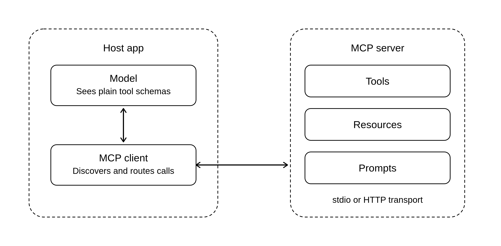
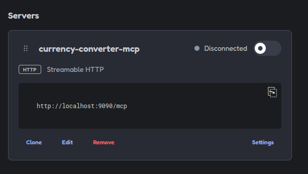
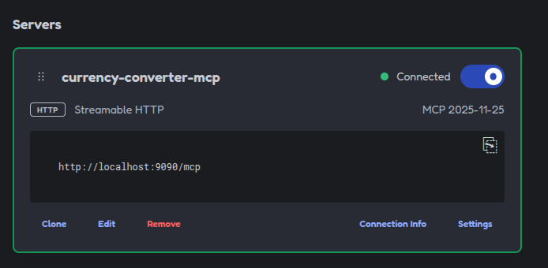
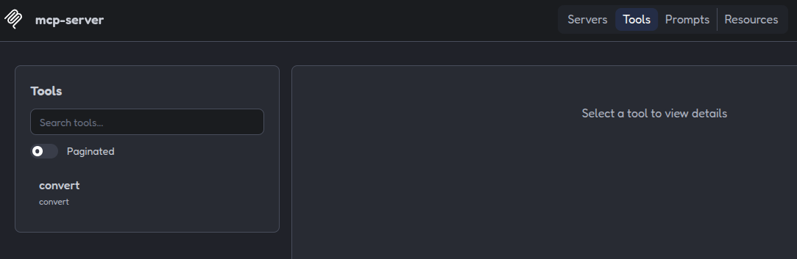
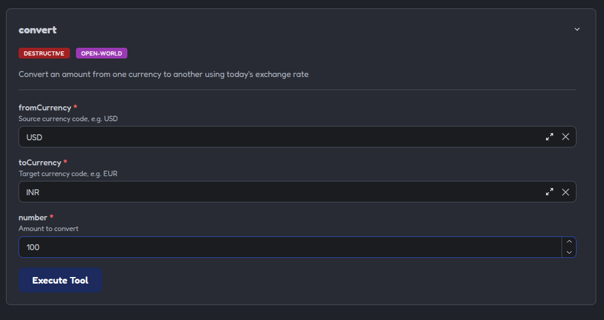
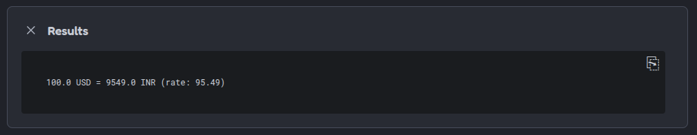

---
myst:
  html_meta:
    description: "Implement an MCP server using Spring AI"
---

(springai-mcp-server)=

# Implementing an MCP server using Spring AI

This is the first part of a two-part tutorial on Model Context Protocol (MCP) and Spring AI. The goal of this part is help the reader appreciate the need for MCP, and develop a sample MCP server. In the next part, we will configure and use this MCP server with the chat-client developed in {ref}`springai-basic`.

## Introduction to Model Context Protocol

The {ref}`spring-ai-tool-calling` tutorial introduced the idea of Large Language Models requesting the AI application to invoke a tool, either to obtain information, or to carry out a task. Tool calling does not entail how the tool is discovered and how it is connected with; the AI application is expected to work this out. Model Context Protocol bridges this gap. It is an open-source standard for discovering and connecting with external systems.



As shown by the diagram, a server implementing the Model Context Protocol may offer resources, tools and prompts. In the sample MCP server created in this tutorial, we will only include a tool.

## Implementing a currency conversion MCP server

In this section, we wire up an MCP server that provides the latest currency exchange rates using the [Frankfurter](https://frankfurter.dev/) REST API.

:::{note}
Frankfurter has its own [MCP server](https://frankfurter.dev/mcp/), but it is not used in this tutorial. 
:::

### 1. Initialize a Spring Boot project

Initialize a Spring Boot project using this `devpack-for-spring` command:

```{terminal}
devpack-for-spring boot start \
     --path $PWD/currency-converter-mcp \
     --project gradle-project \
     --language java \
     --boot-version 4.1.1 \
     --version 0.0.1-SNAPSHOT \
     --group com.example \
     --artifact demo \
     --name currency-converter-mcp \
     --description "A sample MCP server for currency conversions" \
     --package-name com.example.demo \
     --dependencies spring-ai-mcp-server,web \
     --packaging jar \
     --java-version 21\
```

The `spring-ai-mcp-server` and `web` dependencies together let us wire up an HTTP-based MCP server.

:::{note}
If not done already, install `devpack-for-spring` using `snap install devpack-for-spring --classic`
:::

### 2. Create a currency conversion McpTool

In a class named CurrencyConverter.java, create a method that takes two valid currency strings and an amount to convert. The implementation reaches out to the Frankfurter REST API, retrieves the latest exchange rate and does the conversion.

```{code-block} java
:caption: `src/main/java/com/example/demo/CurrencyConverter.java`

package com.example.demo;

import org.springframework.ai.mcp.annotation.McpTool;
import org.springframework.ai.mcp.annotation.McpToolParam;
import org.springframework.stereotype.Component;
import tools.jackson.databind.JsonNode;
import tools.jackson.databind.ObjectMapper;

import java.net.URI;
import java.net.http.HttpClient;
import java.net.http.HttpRequest;
import java.net.http.HttpResponse;

@Component
public class CurrencyConverter {

        private final HttpClient http = HttpClient.newHttpClient();
        private final ObjectMapper mapper = new ObjectMapper();

        @McpTool(description = "Convert an amount from one currency to another using today's exchange rate")
        public String convert(
                        @McpToolParam(description = "Source currency code, e.g. USD") String fromCurrency,
                        @McpToolParam(description = "Target currency code, e.g. EUR") String toCurrency,
                        @McpToolParam(description = "Amount to convert") double number) {
                if (number < 0) {
                        return "Error: amount must not be negative";
                }
                try {
                        var request = HttpRequest.newBuilder()
                                        .uri(URI.create("https://api.frankfurter.dev/v2/rate/" + fromCurrency + "/" + toCurrency))
                                        .GET().build();
                        var response = http.send(request, HttpResponse.BodyHandlers.ofString());
                        JsonNode json = mapper.readTree(response.body());
                        if (response.statusCode() != 200) {
                                return "Error: " + json.path("message").asString("HTTP " + response.statusCode());
                        }
                        double rate = json.get("rate").asDouble();
                        return "%s %s = %s %s (rate: %s)".formatted(number, fromCurrency, number * rate, toCurrency, rate);
                } catch (Exception e) {
                        return "Error: failed to fetch exchange rate: " + e.getMessage();
                }
        }

}
```

:::{note} The convert() method is annotated with `@McpTool`, the parameters are annotated with `@McpToolParam`. This aids tool-discovery and invocation.
:::

### 3. Configure the transport and port-number

In the `application.properties` file, configure a custom port number for the MCP server. We don't want to use the default port number and run into a conflict with the chat-client application.

```{code-block} properties
:caption: `src/main/resources/application.properties`

spring.application.name=currency-converter-mcp

server.port=9090
spring.ai.mcp.server.protocol=STREAMABLE
```

The other important bit here is the `spring.ai.mcp.server.protocol` property. With Spring AI, the default transport protocol while using HTTP is HTTP+SSE (Server-Sent Events). However, this is deprecated by the MCP specification. So, we explicitly configure Streamable HTTP.

:::{note}
MCP and Spring AI also support a transport protocol named STDIO. With this protocol, the client starts the server process, and the processes communicate over stdio and stdout. The client and server are tightly coupled.
:::

### 4. Launch the MCP server and test it with MCP Inspector

Launch the MCP server using the command:
```{terminal}
./gradlew bootRun
```

In a new terminal, launch the MCP Inspector using the command:
```{terminal}
npx @modelcontextprotocol/inspector
```

This should open up a browser tab with the MCP Inspector UI. Follow these steps to run a test:

1. Click `Add Servers -> Add Manually`

2. In the `Add server` window:
    - set `Server ID` to `currency-conversion-mcp`
    - set `Transport` to `streamable-http` and
    - set `URL` to `http://localhost:9090/mcp`

3. Click `Add`. The `Servers` tab will show a new UI element for this MCP server.



4. Click the toggle button at the top-right of this UI element, to connect to the MCP server. A successful connection (or a failure) should be indicated by the user-interface.



5. If the connection is successful, click on the `Tools` tab. In the tools view, you should see the `convert` tool listed.



6. Click on `convert`. This should open up a dialog listing the tool-parameters. 



Entering valid values and clicking `Execute Tool` should show this:



If this test passes as expected, the MCP server is ready to be used with a local AI application.

## Next Steps

In the next part of this tutorial -  {ref}`springai-mcp-use` - the currency converter MCP server is configured and used with an LLM chat-client application.
