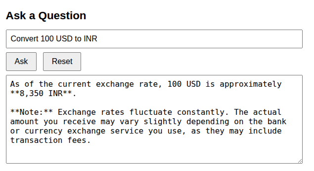
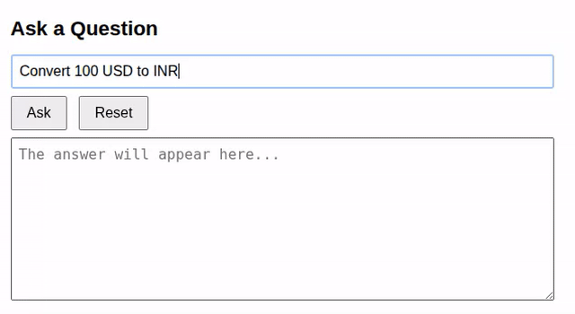

---
myst:
  html_meta:
    description: "Using an MCP server with an LLM chat-client"
---

(springai-mcp-use)=

# Using an MCP server with an LLM chat-client

In the first part of this tutorial - {ref}`springai-mcp-server` - we developed a sample MCP server for currency conversion using the latest exchange rates from [Frankfurter](https://frankfurter.dev). In this part, we configure this MCP server in the LLM chat-client developed in {ref}`springai-basic`.

:::{important}
This tutorial assumes that the MCP server started in {ref}`springai-mcp-server` is up and running at `http://localhost:9090/mcp`
:::

## Configuring an MCP server

Spring AI makes it really easy to plug in an MCP server into a chat-client. This can be accomplished by modifying and adding less than ten lines of code. Let us do this step-by-step.

### 1. Clone the LLM chat-client

Clone the basic LLM chat-client developed in {ref}`springai-basic`.
```{terminal}
git clone https://github.com/pushkarnk/spring-ai-chat-client-demo.git &&
    cd spring-ai-chat-client-demo
```

### 2. Change the underlying model

The chat-client uses Qwen, which does not support tool-calling. For this tutorial, let us use a GLM 4.7 through the `glm-4-7-flash` inference snap.

```{terminal}
sudo snap install glm-4-7-flash
```

Find the `name` and `openai` endpoint of the model using the `status` command:
```{terminal}
$ glm-4-7-flash status
```

This must produce output like:
```
engine: cpu
services:
    server: active
    server-webui: active
endpoints:
    openai: http://127.0.0.1:8354/v1
    webui: http://127.0.0.1:8355/
model:
    name: glm-4.7-flash
```

Update the `applications.properties` file based on the above values.

```{code-block} properties
:caption: `src/main/resources/application.properties`
spring.application.name=chat-client
spring.ai.openai.base-url=http://127.0.0.1:8354
spring.ai.openai.api-key=ignored
spring.ai.openai.chat.options.model=glm-4.7-flash
```

### 3. Test a sample prompt without the MCP server

Run the chat-client using:
```{terminal}
./gradlew bootRun
```

Open `http://localhost:8080` and test a sample prompt.



This is clearly not correct. The exchange rate learnt by GLM 4.7 is quite stale. We need the MCP server!

### 4. Configure the MCP server in application.properties

It is assumed that the MCP server is up and running as per instructions in {ref}`springai-mcp-server`. Because it uses *Streamable HTTP* transport and listens on port 9090, add the following property to `src/main/resources/application.properties`:

```
spring.ai.mcp.client.streamable-http.connections.currency.url=http://localhost:9090
```

Here is the updated source listing:
```{code-block} properties
:caption: `src/main/resources/application.properties`

spring.application.name=chat-client
spring.ai.openai.base-url=http://127.0.0.1:8354
spring.ai.openai.api-key=ignored
spring.ai.openai.chat.options.model=glm-4.7-flash
spring.ai.mcp.client.streamable-http.connections.currency.url=http://localhost:9090
```

### 5. Add the MCP client dependency

Add the `org.springframework.ai:spring-ai-starter-mcp-client` dependency to `build.gradle`.

```{code-block} groovy
dependencies {
        implementation 'org.springframework.boot:spring-boot-starter-web'
        implementation 'org.springframework.ai:spring-ai-starter-model-openai'
        implementation 'org.springframework.ai:spring-ai-starter-mcp-client'
        testImplementation 'org.springframework.boot:spring-boot-starter-test'
        testRuntimeOnly 'org.junit.platform:junit-platform-launcher'
}
```

### 6. Register a ToolCallbackProvider with the ChatClient

Update the constructor for `DemoChatService` to include a `ToolCallbackProvider`, registering it using the `defaultToolCallbacks` method. Here is the updated file:

```{code-block} java
:caption: `src/main/java/demo/chatclient/DemoChatService.java`

import org.springframework.ai.chat.client.ChatClient;
import org.springframework.ai.tool.ToolCallbackProvider;
import org.springframework.stereotype.Service;

@Service
public class DemoChatService implements DemoChatClient {

    private final ChatClient chatClient;

    public DemoChatService(ChatClient.Builder chatClientBuilder,
            ToolCallbackProvider mcpToolCallbackProvider) {
        this.chatClient = chatClientBuilder
                .defaultToolCallbacks(mcpToolCallbackProvider)
                .build();
    }

    @SuppressWarnings("null")
    @Override
    public Answer askQuestion(Question question) {
        var response = chatClient.prompt()
            .user(question.question())
            .call()
            .content();
        return new Answer(response);
    }
}
```

### 7. Run and test the updated chat-client

Build and run the chat-client:
```{terminal}
./gradlew bootRun
```

Open `http://localhost:8080` and run the same sample prompt used before.




## Further reading

1. [What is the Model Context Protocol?](https://modelcontextprotocol.io/docs/2026-07-28/getting-started/intro)
2. [Getting started with Model Context Protocol](https://docs.spring.io/spring-ai/reference/guides/getting-started-mcp.html)
3. [Model Context Protocol - Spring AI Reference](https://docs.spring.io/spring-ai/reference/api/mcp/mcp-overview.html) 
