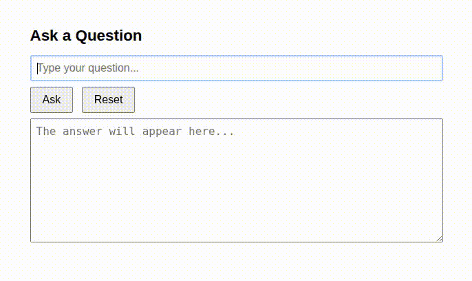
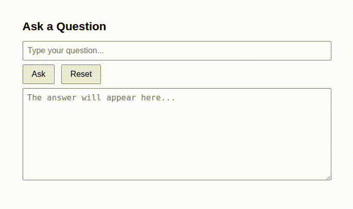

---
myst:
  html_meta:
    description: "Configuring chat memory with Spring AI"
---

(springai-memory)=
# Configuring chat memory with Spring AI

A Large Language Model is a stateless system. The model does not retain conversation history, generating an independent response to every prompt. Without conversational memory and context, it would be impractical to use LLMs in the real world. Spring AI supports chat memory (or conversational memory), to store and retrieve information across multiple interactions with the underlying LLM. In this tutorial, we will add memory to the basic chat-client developed in {ref}`springai-basic`.

To set the context, here is a screen-capture of a conversation with a chat-client without chat memory:



## Adding chat memory to the basic chat-client

Spring AI lets us add chat memory with a very concise code change, using the [Advisor API](https://docs.spring.io/spring-ai/reference/api/advisors.html). Advisors intercept data sent to, and received from, the Large Language Model.

### MessageChatMemoryAdvisor and MessageWindowChatMemory
We simply register a [MessageChatMemoryAdvisor](https://docs.spring.io/spring-ai/docs/current/api/org/springframework/ai/chat/client/advisor/MessageChatMemoryAdvisor.html) with the `ChatClient.Builder`.

This Advisor needs a chat memory implementation. For this tutorial, we use the basic [MessageWindowChatMemory](https://docs.spring.io/spring-ai/reference/api/chat-memory.html#_message_window_chat_memory). It provides an in-memory implementation of a specified size, ensuring the total number of messages does not exceed this limit.

### Conversation identifier
With the `MessageChatMemoryAdvisor`, every question needs to be associated with a conversation identifier. This is critical when multiple users interact with the chat client. For this tutorial, we use a default conversation identifier.


### Steps to add chat memory

#### 1. Clone the basic chat-client repository
The chat-client developed in {ref}`springai-basic` is available in this [repository](https://github.com/pushkarnk/spring-ai-chat-client-demo.git):

```{terminal}
git clone https://github.com/pushkarnk/spring-ai-chat-client-demo.git && \
    cd spring-ai-chat-client-demo
```

#### 2. Update the DemoChatService

We augment the `ChatClient` with a `MessageChatMemoryAdvisor` that uses the `MessageWindowChatMemory` implementation. We also pass the conversation identifier
while submitting the prompt.

```{code-block} java
:caption: `src/main/java/demo/chatclient/DemoChatService.java`

package demo.chatclient;

import org.springframework.ai.chat.client.ChatClient;
import org.springframework.ai.chat.memory.ChatMemory;
import org.springframework.ai.chat.memory.MessageWindowChatMemory;
import org.springframework.ai.chat.client.advisor.MessageChatMemoryAdvisor;
import org.springframework.stereotype.Service;

@Service
public class DemoChatService implements DemoChatClient {

    private final ChatClient chatClient;

    public DemoChatService(ChatClient.Builder chatClientBuilder) {
        ChatMemory chatMemory = MessageWindowChatMemory.builder().build();
        this.chatClient = chatClientBuilder
            .defaultAdvisors(MessageChatMemoryAdvisor.builder(chatMemory).build())
            .build();
    }

    @SuppressWarnings("null")
    @Override
    public Answer askQuestion(Question question, String conversationId) {
        var response = chatClient.prompt()
            .user(question.question())
            .advisors(advisorSpec->advisorSpec.param(ChatMemory.CONVERSATION_ID, conversationId))
            .call()
            .content();
        return new Answer(response);
    }
}
```

:::{note}
`MessageWindowChatMemory.Builder` has a `maxMessages` method that lets us configure the maximum number of stored messages. The default is 20.
:::


#### 3. Update the DemoChatController

Add the conversation identifier (header name `X_AI_CONVERSATION_ID`) as a `RequestHeader` to the handler method. For simplicity, a specified default value ("default") would be used here.

```{code-block} java
:caption: `src/main/java/demo/chatclient/DemoChatController.java`

package demo.chatclient;

import org.springframework.web.bind.annotation.PostMapping;
import org.springframework.web.bind.annotation.RequestBody;
import org.springframework.web.bind.annotation.RequestHeader;
import org.springframework.web.bind.annotation.RestController;

@RestController
public class DemoChatController {

    private final DemoChatClient chatClient;

    public DemoChatController(DemoChatClient chatClient) {
        this.chatClient = chatClient;
    }

    @PostMapping(path = "/ask", produces = "application/json")
    public Answer askQuestion(
        @RequestHeader(name="X_AI_CONVERSATION_ID", defaultValue = "default") String convId,
        @RequestBody Question question) {
        return chatClient.askQuestion(question, convId);
    }
}
```

#### 4. Update the `DemoChatClient` interface

Add the new parameter for the conversation identifier, to the `askQuestion` method.

```{code-block} java
:caption: `src/main/java/demo/chatclient/DemoChatClient.java`

package demo.chatclient;

public interface DemoChatClient {
    Answer askQuestion(Question question, String conversationId);
}
```

#### 5. Run the updated chat client

Build and run the chat client application:
```{terminal}
./gradlew bootRun
```

Open `http://localhost:8080` and do an interaction that exercises chat memory. Here is the screen-capture of a sample interaction:



##  Further reading

`MessageWindowChatMemory` is the simplest implementation of chat memory. It does not persist messages beyond the lifetime of the chat client process. Real-world applications need persistent conversational memory. Spring AI provides [JdbcChatMemoryRepository](https://docs.spring.io/spring-ai/reference/1.1/api/chat-memory.html#_jdbcchatmemoryrepository) for persisting chat memory to a relational database. The API also has support for NoSQL databases like [Cassandra](https://docs.spring.io/spring-ai/reference/1.1/api/chat-memory.html#_cassandrachatmemoryrepository) and [MongoDB](https://docs.spring.io/spring-ai/reference/1.1/api/chat-memory.html#_mongochatmemoryrepository), and for the [neo4j graph database](https://docs.spring.io/spring-ai/reference/api/chat-memory.html#_neo4j_chatmemoryrepository) too.

Spring AI also lets you persist conversation history into a vector database using the [VectorStoreChatMemoryAdvisor](https://docs.spring.io/spring-ai/reference/1.1/api/chat-memory.html#_vectorstorechatmemoryadvisor).
