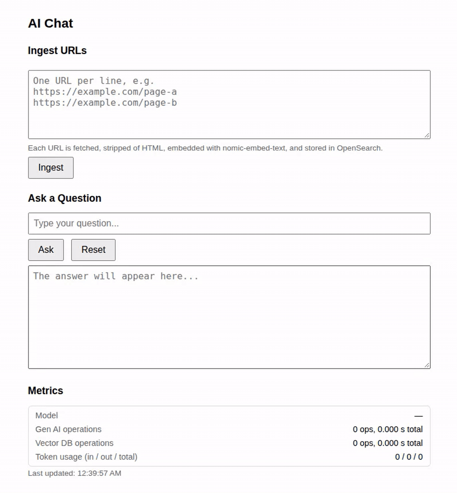
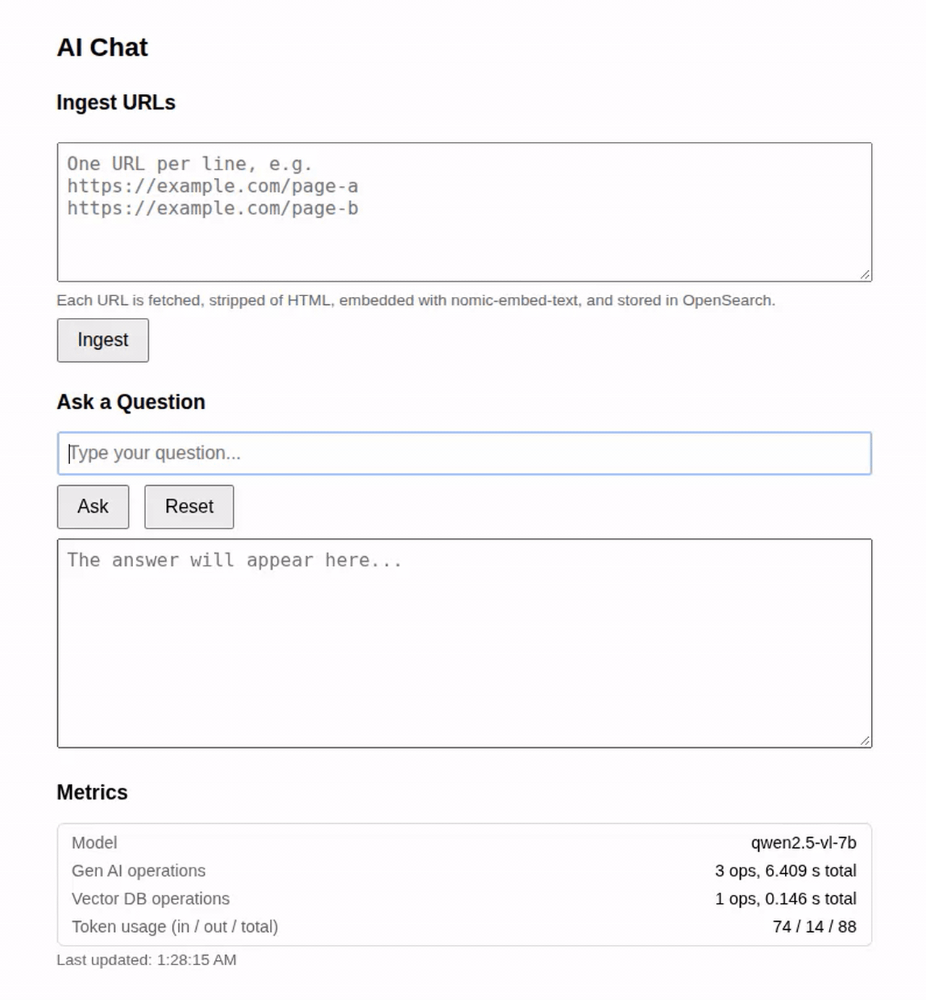
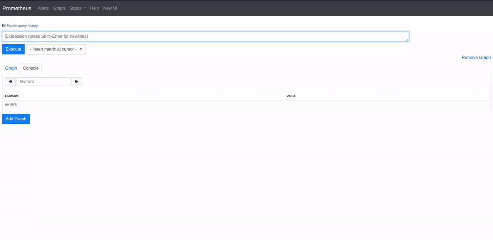

---
myst:
  html_meta:
    description: "Spring AI observability metrics for the Retrieval Augmented Generation sample"
---
(springai-observability)=
# Spring AI and Observability

The tutorial demonstrates how metrics like token usage count, and statistics for model interaction and vector database operations could be fetched from Spring AI. It also demonstrates how easy it is to have these metrics viewed in {pkg}`prometheus`.

## Spring AI metrics for the Retrieval Augmented Generation sample

In the {ref}`springai-rag` tutorial, we implemented Retrieval Augmented Generation using the {pkg}`ollama`/{pkg}`nomic-embed-text` embedding model and storing the embeddings in an {pkg}`opensearch` vector database. This tutorial extends the RAG example by adding Spring AI observability metrics. 

The Spring Boot Actuator is at the center of Spring AI observability. The Actuator presents production-ready features to monitor and manage Spring Boot applications after pushing them to production, through endpoints. This tutorial uses the `/metrics` and `/prometheus` endpoints to fetch Spring AI metrics and view them in {pkg}`prometheus`.

:::{important}
Implementing the {ref}`springai-rag` tutorial is a strict pre-requisite to implement and appreciate this tutorial.
:::

### 1. Reporting Spring AI metrics on the chat-client interface

This tutorial assumes that the user's environment has all the pre-requisites listed in {ref}`springai-rag`.

#### 1.1 Clone the Spring AI Retrieval Augmented Generation sample
```{terminal}
git clone https://github.com/pushkarnk/spring-ai-rag-demo.git
```

#### 1.2 Add the Spring Boot Actuator dependency

Add the following dependency to {file}`build.gradle` to the `dependencies` task:
```{code-block} groovy
implementation 'org.springframework.boot:spring-boot-starter-actuator'
```

#### 1.3 Expose the 'health' and 'metrics' endpoints

Add the following property at the end of {file}`src/main/resource/application.properties`:
```{code-block} properties
management.endpoints.web.exposure.include=health,metrics
```

#### 1.4 Update the chat-client web front-end

We want to have the following information reported on the web front-end of the chat client:
 - Name of the model used
 - Model interaction - number of operations and total time (in seconds) spent on them
 - Vector database operations - number of operations and total time (in seconds) spent on them 
 - Token usage (in / out / total)

:::{note}
The Spring AI metrics fetched from the Actuator endpoints are relevant to the current instance of the Spring AI application. They are reset on application restart.
:::

Here is an updated {file}`src/main/resources/static/index.html`. Copy it into your local project.

```{code-block} html
<!DOCTYPE html>
<html lang="en">
<head>
    <meta charset="UTF-8">
    <meta name="viewport" content="width=device-width, initial-scale=1.0">
    <title>AI Chat</title>
    <style>
        body { font-family: sans-serif; max-width: 700px; margin: 40px auto; padding: 0 16px; }
        h1 { font-size: 1.4rem; }
        h2 { font-size: 1.1rem; margin-top: 24px; }
        input, textarea { width: 100%; box-sizing: border-box; padding: 8px; font-size: 1rem; }
        textarea { resize: vertical; }
        textarea#answer { height: 180px; margin-top: 8px; }
        textarea#urls { height: 120px; margin-top: 8px; }
        .buttons { margin-top: 8px; }
        button { padding: 8px 16px; font-size: 1rem; margin-right: 8px; cursor: pointer; }
        button:disabled { cursor: default; opacity: 0.6; }
        .hint { color: #666; font-size: 0.85rem; margin-top: 4px; }
        .result { font-size: 0.85rem; color: #444; margin-top: 8px; white-space: pre-wrap; }
        .ok { color: #1a7d1a; }
        .err { color: #b00020; }
        .metrics { margin-top: 8px; border: 1px solid #ddd; border-radius: 6px; padding: 4px 12px; font-size: 0.9rem; }
        .metric-row { display: flex; justify-content: space-between; gap: 16px; padding: 4px 0; }
        .metric-name { color: #666; }
        .metric-value { font-variant-numeric: tabular-nums; }
    </style>
</head>
<body>
    <h1>AI Chat</h1>

    <h2>Ingest URLs</h2>
    <textarea id="urls" placeholder="One URL per line, e.g.&#10;https://example.com/page-a&#10;https://example.com/page-b"></textarea>
    <div class="hint">Each URL is fetched, stripped of HTML, embedded with nomic-embed-text, and stored in OpenSearch.</div>
    <div class="buttons">
        <button id="ingestBtn">Ingest</button>
    </div>
    <div id="ingestResult" class="result"></div>

    <h2>Ask a Question</h2>
    <input id="question" type="text" placeholder="Type your question..." />
    <div class="buttons">
        <button id="askBtn">Ask</button>
        <button id="resetBtn">Reset</button>
    </div>
    <textarea id="answer" readonly placeholder="The answer will appear here..."></textarea>

    <h2>Metrics</h2>
    <div class="metrics">
        <div class="metric-row"><span class="metric-name">Model</span><span class="metric-value" id="mModel">—</span></div>
        <div class="metric-row"><span class="metric-name">Gen AI operations</span><span class="metric-value" id="mGenAi">—</span></div>
        <div class="metric-row"><span class="metric-name">Vector DB operations</span><span class="metric-value" id="mVector">—</span></div>
        <div class="metric-row"><span class="metric-name">Token usage (in / out / total)</span><span class="metric-value" id="mTokens">—</span></div>
    </div>
    <div id="metricsStatus" class="hint"></div>
    <script>
        const questionEl = document.getElementById('question');
        const answerEl = document.getElementById('answer');
        const askBtn = document.getElementById('askBtn');
        const resetBtn = document.getElementById('resetBtn');
        const urlsEl = document.getElementById('urls');
        const ingestBtn = document.getElementById('ingestBtn');
        const ingestResultEl = document.getElementById('ingestResult');

        function parseUrls() {
            return urlsEl.value
                .split('\n')
                .map(s => s.trim())
                .filter(s => s.length > 0);
        }

        async function ingest() {
            const urls = parseUrls();
            if (urls.length === 0) {
                ingestResultEl.textContent = 'Please enter at least one URL.';
                ingestResultEl.className = 'result err';
                return;
            }
            ingestBtn.disabled = true;
            ingestResultEl.textContent = 'Ingesting ' + urls.length + ' URL(s)...';
            ingestResultEl.className = 'result';
            try {
                const res = await fetch('/ingest', {
                    method: 'POST',
                    headers: { 'Content-Type': 'application/json' },
                    body: JSON.stringify({ urls })
                });
                if (!res.ok) {
                    throw new Error('Request failed: ' + res.status);
                }
                const data = await res.json();
                ingestResultEl.textContent =
                    'Submitted: ' + data.submitted +
                    ' | Indexed: ' + data.indexed +
                    ' | Skipped: ' + data.skipped;
                ingestResultEl.className = 'result ok';
            } catch (err) {
                ingestResultEl.textContent = 'Error: ' + err.message;
                ingestResultEl.className = 'result err';
            } finally {
                ingestBtn.disabled = false;
            }
        }

        async function ask() {
            const question = questionEl.value.trim();
            if (!question) {
                answerEl.value = 'Please enter a question.';
                return;
            }
            askBtn.disabled = true;
            answerEl.value = 'Thinking...';
            try {
                const res = await fetch('/ask', {
                    method: 'POST',
                    headers: { 'Content-Type': 'application/json' },
                    body: JSON.stringify({ question })
                });
                if (!res.ok) {
                    throw new Error('Request failed: ' + res.status);
                }
                const data = await res.json();
                answerEl.value = data.answer;
            } catch (err) {
                answerEl.value = 'Error: ' + err.message;
            } finally {
                askBtn.disabled = false;
            }
        }

        function reset() {
            questionEl.value = '';
            answerEl.value = '';
            questionEl.focus();
        }

        ingestBtn.addEventListener('click', ingest);
        askBtn.addEventListener('click', ask);
        resetBtn.addEventListener('click', reset);
        questionEl.addEventListener('keydown', (e) => {
            if (e.key === 'Enter') ask();
        });
        const mModelEl = document.getElementById('mModel');
        const mGenAiEl = document.getElementById('mGenAi');
        const mVectorEl = document.getElementById('mVector');
        const mTokensEl = document.getElementById('mTokens');
        const metricsStatusEl = document.getElementById('metricsStatus');

        async function fetchMetric(name, tags) {
            const qs = (tags || []).map(t => 'tag=' + encodeURIComponent(t)).join('&');
            const res = await fetch('/actuator/metrics/' + name + (qs ? '?' + qs : ''));
            if (res.status === 404) return null; // no data yet for this tag combination
            if (!res.ok) throw new Error('Request failed: ' + res.status);
            return res.json();
        }

        function stat(data, statistic) {
            if (!data) return 0;
            const m = (data.measurements || []).find(m => m.statistic === statistic);
            return m ? m.value : 0;
        }

        function tagValues(data, tagName) {
            if (!data) return [];
            const t = (data.availableTags || []).find(t => t.tag === tagName);
            return t ? t.values : [];
        }

        function fmtOps(data) {
            const count = stat(data, 'COUNT');
            const total = stat(data, 'TOTAL_TIME');
            return count + ' ops, ' + total.toFixed(3) + ' s total';
        }

        function fmtTokens(n) {
            return Math.round(n).toLocaleString();
        }

        function detectModel(chatTokenMetric, tokenMetric) {
            // Prefer the model reported on chat responses...
            let models = tagValues(chatTokenMetric, 'gen_ai.response.model');
            if (models.length === 0) {
                // ...otherwise the requested chat model (ignoring the "none" placeholder)...
                models = tagValues(chatTokenMetric, 'gen_ai.request.model')
                    .filter(v => v !== 'none');
            }
            if (models.length === 0) {
                // ...and finally fall back to any requested model seen so far.
                models = tagValues(tokenMetric, 'gen_ai.request.model')
                    .filter(v => v !== 'none');
            }
            return models.length > 0 ? models.join(', ') : '—';
        }

        async function updateMetrics() {
            try {
                const [genAi, vectorDb, tokIn, tokOut, tokTotal, chatTok] = await Promise.all([
                    fetchMetric('gen_ai.client.operation'),
                    fetchMetric('db.vector.client.operation'),
                    fetchMetric('gen_ai.client.token.usage', ['gen_ai.token.type:input']),
                    fetchMetric('gen_ai.client.token.usage', ['gen_ai.token.type:output']),
                    fetchMetric('gen_ai.client.token.usage', ['gen_ai.token.type:total']),
                    fetchMetric('gen_ai.client.token.usage', ['gen_ai.operation.name:chat'])
                ]);
                mModelEl.textContent = detectModel(chatTok, tokTotal);
                mGenAiEl.textContent = fmtOps(genAi);
                mVectorEl.textContent = fmtOps(vectorDb);
                mTokensEl.textContent =
                    fmtTokens(stat(tokIn, 'COUNT')) + ' / ' +
                    fmtTokens(stat(tokOut, 'COUNT')) + ' / ' +
                    fmtTokens(stat(tokTotal, 'COUNT'));
                metricsStatusEl.textContent = 'Last updated: ' + new Date().toLocaleTimeString();
            } catch (err) {
                metricsStatusEl.textContent = 'Metrics unavailable: ' + err.message;
            }
        }

        updateMetrics();
        setInterval(updateMetrics, 5000);
    </script>
</body>
</html>
```

#### 1.5 Launch the application and do a sample interaction

Launch the application using this command:
```{terminal}
SPRING_PROFILES_ACTIVE=tls ./gradlew bootRun
```

The screen capture below shows a sample interaction with the chat-client. Notice the metrics fetched and reported at the bottom of the window. These metrics are fetched from the Actuator's `/metrics` endpoint by Javascript code in the {file}`src/main/resources/static/index.html`.



### 2. Viewing Spring AI metrics in Prometheus

In this section, we will fetch the same metrics as in the previous section, in {pkg}`prometheus`.

:::{note}
The goal of this section is only to help appreciate the ease of fetching Spring AI metrics into prometheus, in a development environment.
:::

#### 2.1 Add the Micrometer Register Prometheus dependency

Add the following dependency to {file}`build.gradle` to the `dependencies` task:
```{code-block} groovy
implementation 'io.micrometer:micrometer-registry-prometheus'
```

#### 2.2 Expose the Actuator's prometheus endpoing

Simply append prometheus to the new property defined in {file}`src/main/resource/application.properties`:
```{code-block} properties
management.endpoints.web.exposure.include=health,metrics,prometheus
```

#### 2.3 Install, configure and launch prometheus

Install the APT package for {pkg}`prometheus`:
```{terminal}
sudo apt install prometheus
```

Update the prometheus configuration in {file}`/etc/prometheus/prometheus.yml`. Add the following `job` at the end of the `scrape_configs` section:

```{code-block} yaml
  - job_name: 'springai'
    metrics_path: '/actuator/prometheus'
    static_configs:
      - targets: ['localhost:8080']
```

:::{important}
Ensure the indentation of the above job description matches the existing jobs.
:::

Finally, launch prometheus:
```
sudo prometheus
```
The Prometheus web UI should now be accessible at `http://localhost:9090`.

#### 2.4 Launch the application and do a sample interaction

Relaunch the application using this command:
```{terminal}
SPRING_PROFILES_ACTIVE=tls ./gradlew bootRun
```

This is a screen-capture of another sample interaction:



#### 2.5 View the metrics in Prometheus

Open `http://localhost:9090` in a browser window. Select the metric from the drop-down list and click `Execute`. This should display the value of the metric in the `Console` tab.

Here is the screen-capture of a sample interaction with prometheus:


:::{note}
The Spring AI application should be running while accessing prometheus. An application restart resets the metrics.
:::
