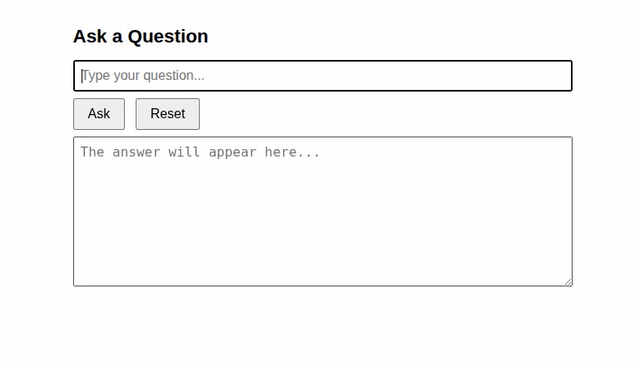
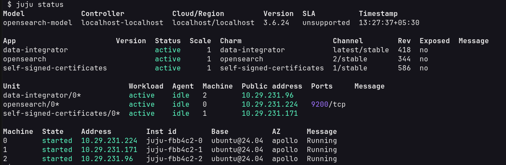
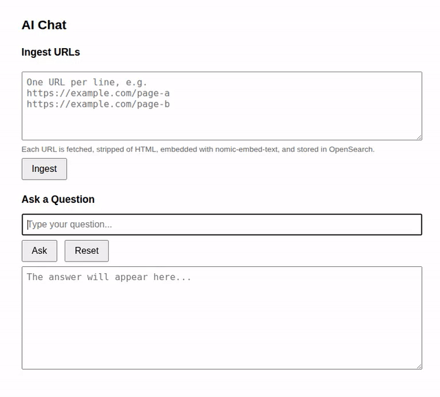

---
myst:
  html_meta:
    description: "Implement an LLM chat-client enabled with retrieval-augmented generation"
---

(springai-rag)=
# Implementing Retrieval Augmented Generation with Spring AI

Every large language model is trained on a corpus of data. There may be prompts that relate to the knowledge of a topic which was not sufficiently covered by the corpus. This often causes hallucinations in models, generating factually incorrect responses. Retrieval Augmented Generation (RAG) lets the user ingest additional information into the model context. The hence expanded model context is likely to reduce hallucinations and produce better responses.



This tutorial demonstrates how Spring AI libraries are used to implement Retrieval Augmented Generation. It uses the Qwen 2.5 model installed as an inference snap. RAG also needs an embedding model and a vector database for data ingestion. The tutorial uses ollama's {pkg}`nomic-embed-text` model and the OpenSearch vector database, respectively.

The front-end is written in HTML and Javascript, with an additional text-box that lets users ingest URLs while prompting.

:::{note}
The demo in this tutorial is likely to consume significant compute resources.
:::


## Set up the pre-requisites

Setting up the environment for this tutorial involves installation of the following:

1. The {pkg}`devpack-for-spring` snap and the {pkg}`spring-ai` content snap.
1. The {pkg}`qwen-vl` inference snap.
1. The {pkg}`ollama` snap.
1. The {pkg}`opensource` charm.


### Install the {pkg}`devpack-for-spring` snap and {pkg}`spring-ai` content snap

Install {pkg}`devpack-for-spring`:

```{terminal}

sudo snap install devpack-for-spring
```

List the available content snaps:

```{terminal}

devpack-for-spring snap list
```

This tutorial uses Spring Boot 3.5.x and hence Spring 1.1.y. So, install {pkg}`content-for-spring-ai-11`:

```{terminal}

devpack-for-spring snap install content-for-spring-ai-11
```


### Install the {pkg}`qwen-vl` inference snap

Install the {pkg}`qwen-vl` snap from the `beta` channel:

```{terminal}

sudo snap install qwen-vl --beta
```

Run the {command}`status` command to ensure it is up and running:

```{terminal}

qwen-vl status
```


### Install the {pkg}`ollama` snap and launch the embedding model

Install the {pkg}`ollama` snap:

```{terminal}

sudo snap install ollama
```

The tutorial uses {pkg}`nomic-embed-text` as a text-embedding model. So, let's pull and launch it:

```{terminal}

ollama pull nomic-embed-text
```


### Deploy the {pkg}`opensource` charm

OpenSearch is a production-grade vector database and is deployed as a Charm. Though simpler alternatives may appear to better suit a tutorial, none of them are charmed. Juju makes it super-easy to set up TLS for OpenSearch and get the credentials to be used by the Spring AI application.


#### Juju installation

Install {pkg}`juju` (skip when already installed):

```{terminal}

sudo snap install juju
```


#### Deploy {pkg}`opensearch`

OpenSearch needs `vm.swappiness` set to 0:

```{terminal}

sudo sysctl -w vm.swappiness=0
```

:::{important}
Note that this is a temporary setting. A restart resets its value to the default.
:::

Add a juju model:

```{terminal}

juju add-model opensearch-model
```

Deploy charms for {pkg}`opensearch` and {pkg}`self-signed-certificates` and integrate them:

```{terminal}

juju deploy opensearch
juju deploy self-signed-certificates
juju integrate opensearch self-signed-certificates
```

This launches a Juju application named OpenSearch and sets up TLS certificates to access it. Give this process a few minutes to complete. To track the state, issue {command}`juju status`.

:::{important}
Eventually, {command}`juju status` shows opensearch blocked on:

```{terminal}
:output-only:

1 or more 'replica' shards are not assigned, please scale your application up.
```

This is addressed in {ref}`unblocking-opensearch`.
:::


#### Get credentials for opensearch

We use the {pkg}`data-integrator` charm for this purpose.

```{terminal}

juju deploy data-integrator --config index-name=demo-index --config extra-user-roles=admin
juju integrate data-integrator opensearch
juju run data-integrator/0 get-credentials
```

From the output of the {command}`get-credentials` command, note the following:

1. The `tls-ca` field holds two certificates. Copy them carefully to a file named {file}`$HOME/os.pem`, ensuring that the leading whitespaces from the output are removed.
1. The `username`, `password`, and `endpoint` fields.

Now, set the following environment variables as per the values noted above (the values used below are samples):

```{terminal}

export OPENSEARCH_CA_CERT=$HOME/os.pem
export OPENSEARCH_USERNAME=opensearch-client_5
export OPENSEARCH_PASSWORD=anPgGF5uGDbmFmYqQ6mARhZ8ilOTTj58
export OPENSEARCH_URI=https://10.29.231.224:9200
```


(unblocking-opensearch)=
#### Unblocking opensearch

As noted before, opensearch is blocked with the message:

```{terminal}
:output-only:

1 or more 'replica' shards are not assigned, please scale your application up.
```

We do not want to scale up opensearch for this simple use-case. So, let's set the replicas to 0.

```{terminal}

curl --cacert $HOME/os.pem -u "$OPENSEARCH_USERNAME:$OPENSEARCH_PASSWORD" \
      -X PUT "$OPENSEARCH_URI/demo-index/_settings" \
      -H 'Content-Type: application/json' -d '{ "index": { "number_of_replicas": 0 } }'
```

This returns `{"acknowledged": true}`, and opensearch unblocks eventually.

Before proceeding to the next step, ensure the {command}`juju status` output is all green.




## Developing a basic Spring AI RAG application


### Bootstrapping a project

Using {command}`devpack-for-spring`, initialize a project that uses Spring Boot 3.5.X. Include the following dependencies:

1. {pkg}`web` - for creating a Spring web application
1. {pkg}`spring-ai-openai` - for interaction with the qwen model's OpenAI interface
1. {pkg}`spring-ai-ollama` - for interaction with the {pkg}`nomic-embed-text` embedding model from ollama
1. {pkg}`spring-ai-vectordb-opensearch` - for interaction with opensearch

```{terminal}

devpack-for-spring boot start \
    --path $PWD/rag-chat-client \
    --project gradle-project \
    --language java \
    --boot-version 3.5.16 \
    --version 0.0.1 \
    --group demo.chatclient.rag \
    --artifact demo \
    --name rag-chat-client \
    --description "An LLM chat client with Retrieval Augmented Generation" \
    --package-name demo.chatclient.rag \
    --dependencies web,spring-ai-openai,spring-ai-ollama,spring-ai-vectordb-opensearch \
    --packaging jar \
    --java-version 21
```


### Define the basic abstractions

Create Java `record`s representing questions (prompts), answers (responses), and ingested URLs. Also, create an `interface` for a chat-client.

```{code-block} java
:caption: `src/main/java/demo/chatclient/rag/Question.java`

package demo.chatclient.rag;

public record Question(String question) {}
```

```{code-block} java
:caption: `src/main/java/demo/chatclient/rag/Answer.java`

package demo.chatclient.rag;

public record Answer(String answer) {}
```

```{code-block} java
:caption: `src/main/java/demo/chatclient/rag/IngestRequest.java`

package demo.chatclient.rag;

import java.util.List;

public record IngestRequest(List<String> urls) {}
```

```{code-block} java
:caption: `src/main/java/demo/chatclient/rag/DemoChatClient.java`

package demo.chatclient.rag;

public interface DemoChatClient {
    Answer askQuestion(Question question);
}
```


### Define the Service classes

Create Spring Boot Services for the chat client and the ingestion. These classes hold the core logic to handle prompts and URL ingestion requests.

```{code-block} java
:caption: `src/main/java/demo/chatclient/rag/IngestService.java`

package demo.chatclient.rag;

import org.slf4j.Logger;
import org.slf4j.LoggerFactory;
import org.springframework.ai.document.Document;
import org.springframework.ai.vectorstore.VectorStore;
import org.springframework.beans.factory.annotation.Value;
import org.springframework.stereotype.Service;
import org.springframework.web.client.RestClient;

import java.net.URI;
import java.util.ArrayList;
import java.util.List;
import java.util.Map;

@Service
public class IngestService {

    private static final Logger log = LoggerFactory.getLogger(IngestService.class);

    private final VectorStore vectorStore;
    private final int batchSize;
    private final RestClient httpClient;

    public IngestService(VectorStore vectorStore,
                         @Value("${app.rag.ingest.batch-size:16}") int batchSize) {
        this.vectorStore = vectorStore;
        this.batchSize = batchSize;
        this.httpClient = RestClient.builder()
                .defaultHeader("User-Agent", "chat-client/rag")
                .build();
    }

    // fetch text from the urls, embed and index it
    public IngestResult ingest(List<String> urls) {
        List<Document> documents = new ArrayList<>();
        int skipped = 0;
        for (String url : urls) {
            try {
                String content = fetch(url);
                if (content.isBlank()) {
                    skipped++;
                    continue;
                }
                documents.add(toDocument(url, content));
            } catch (Exception e) {
                log.warn("Skipping {}: {}", url, e.getMessage());
                skipped++;
            }
        }

        log.info("Embedding and indexing {} documents (skipped {})...", documents.size(), skipped);
        for (int from = 0; from < documents.size(); from += batchSize) {
            int to = Math.min(from + batchSize, documents.size());
            vectorStore.add(documents.subList(from, to));
            log.info("  indexed {}/{}", to, documents.size());
        }

        return new IngestResult(urls.size(), documents.size(), skipped);
    }

    // get text from the url
    private String fetch(String url) {
        return httpClient.get()
                .uri(URI.create(url))
                .retrieve()
                .body(String.class);
    }

    // strip HTML tags, keep the raw URL as metadata
    private static Document toDocument(String url, String body) {
        String text = looksLikeHtml(body) ? stripHtml(body) : body;
        Map<String, Object> metadata = Map.of("url", url);
        return new Document(text, metadata);
    }

    private static boolean looksLikeHtml(String body) {
        String lower = body.length() > 512 ? body.substring(0, 512) : body;
        return lower.toLowerCase().contains("<html") || lower.toLowerCase().contains("<body");
    }

    // drop tags and whitespaces
    private static String stripHtml(String html) {
        return html.replaceAll("(?s)<script.*?</script>", " ")
                .replaceAll("(?s)<style.*?</style>", " ")
                .replaceAll("(?s)<[^>]+>", " ")
                .replaceAll("&nbsp;", " ")
                .replaceAll("\\s+", " ")
                .trim();
    }

    public record IngestResult(int submitted, int indexed, int skipped) {}
}
```

The `ingest()` method is the entry point into `IngestService`. It gets the content of each URL, massages it by removing HTML tags and whitespaces, and passes it to `VectorStore.add()`. This method takes the text through the {pkg}`ollama`/{pkg}`nomic-embed-text` embedding model and stores the embeddings in the {pkg}`opensearch` vector database. Though the connections to the embedding model and {pkg}`opensearch` are not seen in the code, the application config in {file}`application.properties` sets up this internal wiring in Spring AI.

```{code-block} java
:caption: `src/main/java/demo/chatclient/rag/DemoChatService.java`

package demo.chatclient.rag;

import org.springframework.ai.chat.client.ChatClient;
import org.springframework.ai.document.Document;
import org.springframework.ai.vectorstore.SearchRequest;
import org.springframework.ai.vectorstore.VectorStore;
import org.springframework.beans.factory.annotation.Value;
import org.springframework.stereotype.Service;

import java.util.List;
import java.util.stream.Collectors;

@Service
public class DemoChatService implements DemoChatClient {

    private static final String SYSTEM = """
            You answer the user's question using ONLY the context provided.
            The context is content fetched from web pages. If the context contains
            nothing relevant, say so plainly instead of guessing. Be concise.""";

    private final ChatClient chatClient;
    private final VectorStore vectorStore;
    private final int topK;

    public DemoChatService(ChatClient.Builder chatClientBuilder,
                           VectorStore vectorStore,
                           @Value("${app.rag.top-k:5}") int topK) {
        this.chatClient = chatClientBuilder.defaultSystem(SYSTEM).build();
        this.vectorStore = vectorStore;
        this.topK = topK;
    }

    @SuppressWarnings("null")
    @Override
    public Answer askQuestion(Question question) {
        List<Document> hits = retrieve(question.question(), topK);
        String context = hits.stream()
                .map(Document::getText)
                .collect(Collectors.joining("\n\n"));

        String response = chatClient.prompt()
            .user(u -> u.text("""
                    Context:

                    {context}

                    Question: {question}""")
                    .param("context", context)
                    .param("question", question.question()))
            .call()
            .content();
        return new Answer(response);
    }

    private List<Document> retrieve(String question, int k) {
        return vectorStore.similaritySearch(
                SearchRequest.builder().query(question).topK(k).build());
    }
}
```

Note the default system prompt defined in `static String SYSTEM`. This string gets applied to the prompt by default. The `askQuestion()` method is the entrypoint into the `DemoChatService` logic. This method, based on the question text, retrieves the top K (K Nearest Neighbors) matching documents from the vector database. The text in these entries is then passed to the Qwen model, along with the question.


### Define the Controller classes

The `Controller`s define the REST endpoints and invoke `Service`s defined previously.

```{code-block} java
:caption: `src/main/java/demo/chatclient/rag/IngestController.java`

package demo.chatclient.rag;

import org.springframework.web.bind.annotation.PostMapping;
import org.springframework.web.bind.annotation.RequestBody;
import org.springframework.web.bind.annotation.RestController;

@RestController
public class IngestController {

    private final IngestService ingestService;

    public IngestController(IngestService ingestService) {
        this.ingestService = ingestService;
    }

    @PostMapping(path = "/ingest", produces = "application/json")
    public IngestService.IngestResult ingest(@RequestBody IngestRequest request) {
        return ingestService.ingest(request.urls());
    }
}
```

```{code-block} java
:caption: `src/main/java/demo/chatclient/rag/DemoChatController.java`

package demo.chatclient.rag;

import org.springframework.web.bind.annotation.PostMapping;
import org.springframework.web.bind.annotation.RequestBody;
import org.springframework.web.bind.annotation.RestController;

@RestController
public class DemoChatController {

    private final DemoChatClient chatClient;

    public DemoChatController(DemoChatClient chatClient) {
        this.chatClient = chatClient;
    }

    @PostMapping(path = "/ask", produces = "application/json")
    public Answer askQuestion(@RequestBody Question question) {
        return chatClient.askQuestion(question);
    }
}
```


### Define Spring AI configuration through properties files

Given how much functionality this small application is able to provide, it is easy to guess that much of the ground-work is done by configuration-based wiring in Spring Boot and Spring AI. The two properties files below are hence a significant part of the project.

```{code-block} properties
:caption: `src/main/resources/application.properties`

spring.application.name=rag-chat-client
server.port=8080

# Spring AI config
spring.ai.model.chat=openai
spring.ai.model.embedding=ollama

# OpenAI config
spring.ai.openai.base-url=http://localhost:8326/v3
spring.ai.openai.api-key=ignored
spring.ai.openai.chat.options.model=Qwen2.5-VL-3B-Instruct-ov-int4
spring.ai.openai.chat.options.temperature=0.1
spring.ai.openai.chat.completions-path=/chat/completions

# Ollama config
spring.ai.ollama.base-url=http://localhost:11434
spring.ai.ollama.embedding.options.model=nomic-embed-text
spring.ai.ollama.init.timeout=5m

# Opensearch config
spring.ai.vectorstore.opensearch.uris=${OPENSEARCH_URI}
spring.ai.vectorstore.opensearch.username=${OPENSEARCH_USERNAME}
spring.ai.vectorstore.opensearch.password=${OPENSEARCH_PASSWORD}
spring.ai.vectorstore.opensearch.index-name=${OPENSEARCH_INDEX:url-docs}
spring.ai.vectorstore.opensearch.initialize-schema=true

# RAG config
app.rag.top-k=5
app.rag.ingest.batch-size=16
```

A few notes about the values used above:

 - The OpenAI base URL is reported by the {command}`qwen-vl status` command.

 - To infer the model id, use this command:

   ```{terminal}

   curl http://localhost:8326/v3/models 2>/dev/null | jq | grep "id"
   ```

 - The Ollama base URL is a commonly known default value.

 - To define a custom Opensearch index name, use OPENSEARCH_INDEX. The tutorial uses `url-docs` as default.

We need this additional configuration to enable the application to connect to a TLS-secured OpenSearch instance. Note that this falls under a different profile named `tls`, which needs to be activated during execution.

```{code-block} properties
:caption: `src/main/resources/application-tls.properties`

# OpenSearch TLS profile, needed when talking to a TLS-secured OpenSearch
# Activate with SPRING_PROFILES_ACTIVE=tls
spring.ssl.bundle.pem.opensearch.truststore.certificate=file:${OPENSEARCH_CA_CERT}
spring.ai.vectorstore.opensearch.ssl-bundle=opensearch
```


### HTML for the front-end

Use the following HTML for the landing web-page.

```{code-block} html
:caption: `src/main/resources/static/index.html`

<!DOCTYPE html>
<html lang="en">
<head>
    <meta charset="UTF-8">
    <meta name="viewport" content="width=device-width, initial-scale=1.0">
    <title>AI Chat</title>
    <style>
        body { font-family: sans-serif; max-width: 700px; margin: 40px auto; padding: 0 16px; }
        h1 { font-size: 1.4rem; }
        h2 { font-size: 1.1rem; margin-top: 24px; }
        input, textarea { width: 100%; box-sizing: border-box; padding: 8px; font-size: 1rem; }
        textarea { resize: vertical; }
        textarea#answer { height: 180px; margin-top: 8px; }
        textarea#urls { height: 120px; margin-top: 8px; }
        .buttons { margin-top: 8px; }
        button { padding: 8px 16px; font-size: 1rem; margin-right: 8px; cursor: pointer; }
        button:disabled { cursor: default; opacity: 0.6; }
        .hint { color: #666; font-size: 0.85rem; margin-top: 4px; }
        .result { font-size: 0.85rem; color: #444; margin-top: 8px; white-space: pre-wrap; }
        .ok { color: #1a7d1a; }
        .err { color: #b00020; }
    </style>
</head>
<body>
    <h1>AI Chat</h1>

    <h2>Ingest URLs</h2>
    <textarea id="urls" placeholder="One URL per line, e.g.&#10;https://example.com/page-a&#10;https://example.com/page-b"></textarea>
    <div class="hint">Each URL is fetched, stripped of HTML, embedded with nomic-embed-text, and stored in OpenSearch.</div>
    <div class="buttons">
        <button id="ingestBtn">Ingest</button>
    </div>
    <div id="ingestResult" class="result"></div>

    <h2>Ask a Question</h2>
    <input id="question" type="text" placeholder="Type your question..." />
    <div class="buttons">
        <button id="askBtn">Ask</button>
        <button id="resetBtn">Reset</button>
    </div>
    <textarea id="answer" readonly placeholder="The answer will appear here..."></textarea>

    <script>
        const questionEl = document.getElementById('question');
        const answerEl = document.getElementById('answer');
        const askBtn = document.getElementById('askBtn');
        const resetBtn = document.getElementById('resetBtn');
        const urlsEl = document.getElementById('urls');
        const ingestBtn = document.getElementById('ingestBtn');
        const ingestResultEl = document.getElementById('ingestResult');

        function parseUrls() {
            return urlsEl.value
                .split('\n')
                .map(s => s.trim())
                .filter(s => s.length > 0);
        }

        async function ingest() {
            const urls = parseUrls();
            if (urls.length === 0) {
                ingestResultEl.textContent = 'Please enter at least one URL.';
                ingestResultEl.className = 'result err';
                return;
            }
            ingestBtn.disabled = true;
            ingestResultEl.textContent = 'Ingesting ' + urls.length + ' URL(s)...';
            ingestResultEl.className = 'result';
            try {
                const res = await fetch('/ingest', {
                    method: 'POST',
                    headers: { 'Content-Type': 'application/json' },
                    body: JSON.stringify({ urls })
                });
                if (!res.ok) {
                    throw new Error('Request failed: ' + res.status);
                }
                const data = await res.json();
                ingestResultEl.textContent =
                    'Submitted: ' + data.submitted +
                    ' | Indexed: ' + data.indexed +
                    ' | Skipped: ' + data.skipped;
                ingestResultEl.className = 'result ok';
            } catch (err) {
                ingestResultEl.textContent = 'Error: ' + err.message;
                ingestResultEl.className = 'result err';
            } finally {
                ingestBtn.disabled = false;
            }
        }

        async function ask() {
            const question = questionEl.value.trim();
            if (!question) {
                answerEl.value = 'Please enter a question.';
                return;
            }
            askBtn.disabled = true;
            answerEl.value = 'Thinking...';
            try {
                const res = await fetch('/ask', {
                    method: 'POST',
                    headers: { 'Content-Type': 'application/json' },
                    body: JSON.stringify({ question })
                });
                if (!res.ok) {
                    throw new Error('Request failed: ' + res.status);
                }
                const data = await res.json();
                answerEl.value = data.answer;
            } catch (err) {
                answerEl.value = 'Error: ' + err.message;
            } finally {
                askBtn.disabled = false;
            }
        }

        function reset() {
            questionEl.value = '';
            answerEl.value = '';
            questionEl.focus();
        }

        ingestBtn.addEventListener('click', ingest);
        askBtn.addEventListener('click', ask);
        resetBtn.addEventListener('click', reset);
        questionEl.addEventListener('keydown', (e) => {
            if (e.key === 'Enter') ask();
        });
    </script>
</body>
</html>
```


## Running the RAG chat client

Install {pkg}`openjdk-17-jdk` (skip when already installed).

```{terminal}

sudo apt update && sudo apt install openjdk-17-jdk
```

Run the RAG application:

```{terminal}

SPRING_PROFILES_ACTIVE=tls ./gradlew bootRun
```

The application is now accessible in a browser at `https://localhost:8080`.

:::{important}
As mentioned before, the {pkg}`opensearch` application might get blocked again with this message:

```{terminal}
:output-only:

1 or more 'replica' shards are not assigned, please scale your application up.
```

Note that the index used now is `url-docs`. Run this command:

```{terminal}

curl --cacert $HOME/os.pem -u "$OPENSEARCH_USERNAME:$OPENSEARCH_PASSWORD" \
      -X PUT "$OPENSEARCH_URI/url-docs/_settings" \
      -H 'Content-Type: application/json' -d '{ "index": { "number_of_replicas": 0 } }'
```
:::

Here is the screen-capture of a sample run.


