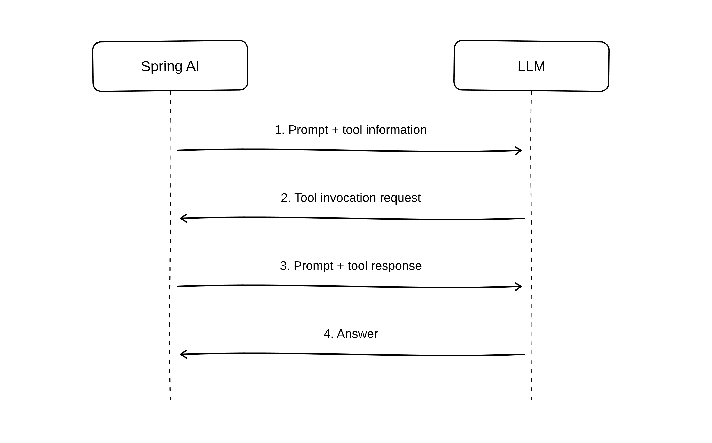

---
myst:
  html_meta:
    description: "Extend an existing Spring AI chatbot to support tool-calling"
---
(spring-ai-tool-calling)=
# Implementing tool-calling with Spring AI

The goal of this tutorial is to help appreciate the ease with which tool-calling may be implemented using Spring AI, on the client-side. We will augment the chat-client from our initial Spring AI tutorial to include a tool interaction that helps the LLM answer queries related to toolchains availability on Ubuntu versions.

## Introduction to LLM tool-calling
Large language models cannot answer questions about data they are not trained on. We previously saw how Retrieval Augmented Generation provides additional information to an LLM in the form of documents. Additional information may also be generated, or deduced from existing data sources, through application logic. If an LLM is made aware of a set of existing _tools_ and the kind of information they serve, it can invoke them while answering a user question, and use the received information to generate a response. This is referred to as tool-calling.

Apart from information retrieval, tools may also be configured to take action. For example, we may configure tools for tasks such as sending an email, triggering a workflow, or updating a database, on a prompt to the LLM.

:::{note}
Not all LLMs support tool-calling.
:::

## Tool-calling support in Spring AI
Spring AI eases tool interactions with LLMs that support tools. It provides a consistent means of applying tools when submitting a prompt. 

Methods annotated using the `@Tool` annotation act as tool-callbacks. The `description` parameter must be used to suitably word the tool description. LLMs depend on these descriptions to decide which tool to invoke for a given prompt.

The `@Tool` methods should belong to a Spring bean class annotated as `@Component`, whose object may be registered with a `ChatClient`. For such a client, Spring AI auto-generates a JSON object with the tool information while making requests to the LLM backend.

Here is a basic diagram that depicts the tool-calling protocol with Spring AI.  




## An LLM chat-client augmented with a tool

This tutorial will reuse the simple chat-client developed in the {ref}`springai-basic` tutorial. However, we will use the gemma4 model instead of Qwen VL 2.5.

1. Install the gemma4 snap:
```bash
sudo snap install gemma4
```

2. Make sure gemma4 is active by issuing the `gemma4 status` command:
```bash
$ gemma4 status
engine: amd-gpu
services:
    server: active
    server-webui: active
endpoints:
    openai: http://127.0.0.1:8336/v1
    webui: http://127.0.0.1:8337/
model:
    name: gemma4-e4b-q4-k-m
```

3. Clone the simple chat-client demo repository:
```bash
git clone https://github.com/pushkarnk/spring-ai-chat-client-demo && cd spring-ai-chat-client-demo
```

4. Update `src/main/resources/application.properties` to the following values:
```properties
spring.application.name=chat-client
spring.ai.openai.base-url=http://127.0.0.1:8336
spring.ai.openai.api-key=ignored
spring.ai.openai.chat.options.model=gemma4-e4b-q4-k-m
```

5. Make sure you have JDK 21 installed and run the application:
```bash
sudo apt update && sudo apt install openjdk-21-jdk
```

```bash
./gradlew bootRun
```

6. Open `http://localhost:8080` in a browser window and enter the following question:

```none
Is Zig 0.16 available on Ubuntu?
```

The answer doesn't really make sense:
```none
While Zig is generally available for Linux, getting a very specific and potentially older version like **0.16** directly through standard Ubuntu package managers (like `apt`) can be dif   ficult because the official repositories often lag behind the latest stable releases.
```

### Adding a tool to the Spring AI application

The `rmadison` command line utility fetches archive package data that can help answer such questions. Let's set up a tool that invokes this command.

1. Add a new @Component class named `UbuntuTools.java` with the following implementation:
```java
package demo.chatclient;

import org.slf4j.Logger;
import org.slf4j.LoggerFactory;
import org.springframework.ai.tool.annotation.Tool;
import org.springframework.ai.tool.annotation.ToolParam;
import org.springframework.stereotype.Component;

import java.io.BufferedReader;
import java.io.IOException;
import java.io.InputStreamReader;
import java.nio.charset.StandardCharsets;

@Component
public class UbuntuTools {
    private static final Logger logger = LoggerFactory.getLogger(UbuntuTools.class);

    @Tool (description = "Query the Ubuntu archive for package names and their versions across Ubuntu versions.")
    public String rmadison(
        @ToolParam(description = "Source or binary package name") String packageName
    ) {
        logger.info("Running rmadison for package: {}", packageName);
        try {
            Process process = new ProcessBuilder("rmadison", packageName)
                .redirectErrorStream(true)
                .start();

            String output;
            try (BufferedReader reader = new BufferedReader(
                    new InputStreamReader(process.getInputStream(), StandardCharsets.UTF_8))) {
                output = reader.lines().reduce("", (a, b) -> a + b + System.lineSeparator());
            }

            process.waitFor();
            return output;
        } catch (IOException e) {
            return "Failed to run rmadison: " + e.getMessage();
        } catch (InterruptedException e) {
            Thread.currentThread().interrupt();
            return "rmadison command interrupted: " + e.getMessage();
        }
    }
}
```

The `rmadison()` method invokes the rmadison utility on the package name received from the LLM. This method is a `@Tool`. The result is converted to a String and returned to the LLM along with the user question.

2. Instantiate an object of class `UbuntuTools` and configure it as a tools object while building the chat client. Modify `src/main/java/demo/chatclient/DemoChatService.java` and modify the constructor source.
:::{note}
This is not a full source listing of DemoChatService.java
:::

```java
...
public class DemoChatService implements DemoChatClient {

    private final ChatClient chatClient;

    public DemoChatService(ChatClient.Builder chatClientBuilder) {
        this.chatClient = chatClientBuilder
                            .defaultTools(new UbuntuTools())
                            .build();
    }

    ...
...
}
```
3. Launch the application and navigate to `http://localhost:8080`.

```none
./gradlew bootRun
```

4. Let us try posting questions again.

Post the zig0.16 question:
```none
Is zig0.16 available in Ubuntu?
```

This time we get a better answer. Something like:
```none
Yes, according to the Ubuntu archive, a package named **zig0.16** is available.

It has the version **0.16.0~us1-0ubuntu1** and can be found in the `stonking/universe` repository for multiple architectures (amd64, amd64v3, arm64, riscv64, s390x).
```

On the terminal running the server, a log message confirming the tool invocation should be seen:
```none
2026-07-14T20:28:12.861+05:30  INFO 303854 --- [chat-client] [nio-8080-exec-1] demo.chatclient.UbuntuTools              : Running rmadison for package: zig0.16
```

Try posting a question about zig0.17, an unreleased version:
```none
Is zig0.17 available in Ubuntu?
```

An answer like the following should be expected:
```none
Based on the available information, the package `zig0.17` does not appear to be available in the Ubuntu archive.
```
