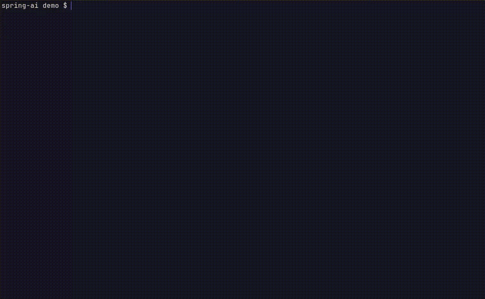
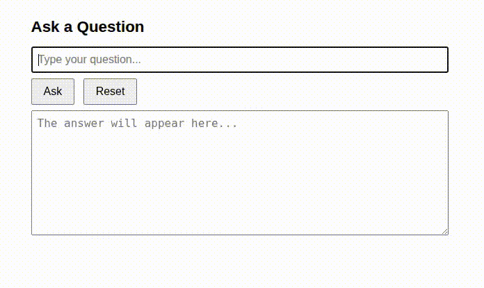

---
myst:
  html_meta:
    description: "Getting started with Spring AI using devpack-for-spring"
---

(springai-basic)=
# Developing an LLM chat-client with Spring AI

This tutorial aims to provide a quick, hands-on introduction to Spring AI. Starting with [devpack-for-spring](https://www.youtube.com/watch?v=aHYwD8yTUZA), and using a locally installed large language model, the tutorial demonstrates how easy it is to create an LLM chat-client using Spring AI.


## Introduction to Spring AI

The [Spring AI](https://docs.spring.io/spring-ai/reference/index.html) project aims to streamline development of applications that incorporate artificial intelligence functionality. It is an extension to the Spring and Spring Boot frameworks. It includes abstractions for various artificial intelligence interactions and protocols that hide complexity and provide an easy programming interface for Java applications. Spring AI offers a consistent interface across AI providers and models, making your code portable.

Spring AI's core abstractions include:

 - [ChatClient API](https://docs.spring.io/spring-ai/reference/api/chatclient.html)
 - [Structured output converters](https://docs.spring.io/spring-ai/reference/api/structured-output-converter.html)
 - [Prompt templates](https://docs.spring.io/spring-ai/reference/api/prompt.html)

 The advanced features include support for:

 - [Retrieval-Augmented Generation (RAG)](https://docs.spring.io/spring-ai/reference/api/chatclient.html#_retrieval_augmented_generation)
 - [Vector databases](https://docs.spring.io/spring-ai/reference/api/vectordbs.html)
 - [Tool/Function calling](https://docs.spring.io/spring-ai/reference/api/tools.html)
 - [Model Context Protocol (MCP)](https://docs.spring.io/spring-ai/reference/api/mcp/mcp-overview.html)
 - [Observability](https://docs.spring.io/spring-ai/reference/observability/index.html)

 The above feature-set makes LLM interactions effortless and other complex interactions relatively easier.


## An LLM chat-client using Spring AI

In this tutorial, Spring AI's ChatClient API is used to create a simple LLM chat-client. The application offers a REST API to send questions to a configured LLM, and relay the answers as responses. We use Qwen 2.5 VL model installed locally using an inference snap. The {command}`devpack-for-spring` CLI is used to initialize this application.


### Installing Qwen 2.5 VL locally

Install {pkg}`qwen-vl` for the 2.5 track:

```{terminal}

sudo snap install qwen-vl --channel 2.5/beta
```

To check the status, use the {command}`status` command. We revisit this in a later section.

```{terminal}

qwen-vl status
```

When the {command}`status` command reports an openai endpoint, Qwen 2.5 VL is installed and the server used to perform inference with it is up and running. To learn more, refer to the [documentation](https://documentation.ubuntu.com/inference-snaps/) on inference snaps.


### Initializing the chat-client project

Install {pkg}`devpack-for-spring` (skip this step when already installed):

```{terminal}

sudo snap install devpack-for-spring --classic
```

Install the content snap for Spring AI:

```{terminal}

devpack-for-spring snap install content-for-spring-ai-11
```

:::{important}
The {pkg}`content-for-spring-ai-11` snap installs Spring AI 1.1.X, which is compatible with Spring Boot 3.5.X.
:::

To initialize a Spring Boot and Spring AI project, use {command}`devpack-for-spring`'s CLI wizard.



Alternatively, initialize it using this command:

```{terminal}

devpack-for-spring boot start \
    --path $PWD/chat-client \
    --project gradle-project \
    --language java \
    --boot-version 3.5.15 \
    --version 0.0.1-SNAPSHOT \
    --group demo.chatclient \
    --artifact demo \
    --name chat-client \
    --description "An LLM chat-client using Spring AI" \
    --package-name demo.chatclient \
    --dependencies spring-ai-openai,web \
    --packaging jar \
    --java-version 21
```

:::{important}
Note the chosen dependencies. The {pkg}`spring-ai-openai` dependency supports interaction with OpenAI-compatible models. The {pkg}`web` dependency supports the creation of an HTTP endpoint.
:::


### Implementing the chat-client backend

After successful project initialization, you find the file {file}`src/main/java/demo/chatclient/ChatClientApplication.java`. The code in this file marks the primary entry point of your application. We now add code related to the LLM chat-client application.

Let us first define the basic abstractions.

File {file}`src/main/java/demo/chatclient/Question.java` defines the Question type.

```{code-block} java
:caption: `src/main/java/demo/chatclient/Question.java`

package demo.chatclient;

public record Question(String question) {}
```

File {file}`src/main/java/demo/chatclient/Answer.java` defines the Answer type.

```{code-block} java
:caption: `src/main/java/demo/chatclient/Answer.java`

package demo.chatclient;

public record Answer(String answer) {}
```

File {file}`src/main/java/demo/chatclient/DemoChatClient.java` defines the basic chat-client interface.

```{code-block} java
:caption: `src/main/java/demo/chatclient/DemoChatClient.java`

package demo.chatclient;

public interface DemoChatClient {
    Answer askQuestion(Question question);
}
```

We then add a service implementing the above interface and a controller that defines the REST endpoint.

File {file}`src/main/java/demo/chatclient/DemoChatService.java` implements the DemoChatClient interface.

```{code-block} java
:caption: `src/main/java/demo/chatclient/DemoChatService.java`

package demo.chatclient;

import org.springframework.ai.chat.client.ChatClient;
import org.springframework.stereotype.Service;

@Service
public class DemoChatService implements DemoChatClient {

    private final ChatClient chatClient;

    public DemoChatService(ChatClient.Builder chatClientBuilder) {
        this.chatClient = chatClientBuilder.build();
    }

    @SuppressWarnings("null")
    @Override
    public Answer askQuestion(Question question) {
        var response = chatClient.prompt()
            .user(question.question())
            .call()
            .content();
        return new Answer(response);
    }
}
```

File {file}`src/main/java/demo/chatclient/DemoChatController.java` adds the RestController to create an endpoint named `/ask`

```{code-block} java
:caption: `src/main/java/demo/chatclient/DemoChatController.java`

package demo.chatclient;

import org.springframework.web.bind.annotation.PostMapping;
import org.springframework.web.bind.annotation.RequestBody;
import org.springframework.web.bind.annotation.RestController;

@RestController
public class DemoChatController {

    private final DemoChatClient chatClient;

    public DemoChatController(DemoChatClient chatClient) {
        this.chatClient = chatClient;
    }

    @PostMapping(path = "/ask", produces = "application/json")
    public Answer askQuestion(@RequestBody Question question) {
        return chatClient.askQuestion(question);
    }
}
```


### Adding a simple HTML frontend

Paste the following code into {file}`src/main/resources/static/index.html`:

```{code-block} html
:caption: `src/main/resources/static/index.html`

<!DOCTYPE html>
<html lang="en">
<head>
    <meta charset="UTF-8">
    <meta name="viewport" content="width=device-width, initial-scale=1.0">
    <title>AI Chat</title>
    <style>
        body { font-family: sans-serif; max-width: 600px; margin: 40px auto; padding: 0 16px; }
        h1 { font-size: 1.4rem; }
        input, textarea { width: 100%; box-sizing: border-box; padding: 8px; font-size: 1rem; }
        textarea { height: 180px; margin-top: 8px; resize: vertical; }
        .buttons { margin-top: 8px; }
        button { padding: 8px 16px; font-size: 1rem; margin-right: 8px; cursor: pointer; }
    </style>
</head>
<body>
    <h1>Ask a Question</h1>
    <input id="question" type="text" placeholder="Type your question..." />
    <div class="buttons">
        <button id="askBtn">Ask</button>
        <button id="resetBtn">Reset</button>
    </div>
    <textarea id="answer" readonly placeholder="The answer will appear here..."></textarea>

    <script>
        const questionEl = document.getElementById('question');
        const answerEl = document.getElementById('answer');
        const askBtn = document.getElementById('askBtn');
        const resetBtn = document.getElementById('resetBtn');

        async function ask() {
            const question = questionEl.value.trim();
            if (!question) {
                answerEl.value = 'Please enter a question.';
                return;
            }
            askBtn.disabled = true;
            answerEl.value = 'Thinking...';
            try {
                const res = await fetch('/ask', {
                    method: 'POST',
                    headers: { 'Content-Type': 'application/json' },
                    body: JSON.stringify({ question })
                });
                if (!res.ok) {
                    throw new Error('Request failed: ' + res.status);
                }
                const data = await res.json();
                answerEl.value = data.answer;
            } catch (err) {
                answerEl.value = 'Error: ' + err.message;
            } finally {
                askBtn.disabled = false;
            }
        }

        function reset() {
            questionEl.value = '';
            answerEl.value = '';
            questionEl.focus();
        }

        askBtn.addEventListener('click', ask);
        resetBtn.addEventListener('click', reset);
        questionEl.addEventListener('keydown', (e) => {
            if (e.key === 'Enter') ask();
        });
    </script>
</body>
</html>
```


### Configuring the LLM to be used

We installed the Qwen 2.5 VL model through the {pkg}`qwen-vl` inference snap. To configure Spring AI to use this model, we need to find the model-id and its openai endpoint.

```{terminal}

qwen-vl status

engine: intel-gpu
endpoints:
    openai: http://localhost:8326/v3
```

The openai endpoint is `http://localhost:8326/v3`.

```{terminal}

curl http://localhost:8326/v3/models 2>/dev/null | jq | grep "id"

      "id": "Qwen2.5-VL-3B-Instruct-ov-int4",
```

The model-id is `Qwen2.5-VL-3B-Instruct-ov-int4`.

Use the above values to define properties in {file}`src/main/resources/application.properties`:

```{code-block} properties
:caption: `src/main/resources/application.properties`

spring.application.name=chat-client
spring.ai.openai.base-url=http://localhost:8326/v3
spring.ai.openai.api-key=ignored
spring.ai.openai.chat.options.model=Qwen2.5-VL-3B-Instruct-ov-int4
```

:::{attention}
Because we are using a local inference model, we do not need to provide an API key. The `spring.ai.openai.api-key` property is mandatory to access online models.
:::


### Launching and using the chat-client

We are now set to launch the chat-client application and run simple prompts.

Before launching the application, ensure you have {pkg}`openjdk-21-jdk` installed:

```{terminal}

sudo apt install openjdk-21-jdk
```

Launch the application using this command:

```{terminal}

./gradlew bootRun
```

A successful launch produces a log message indicating the application started. No exceptions are logged.

```{terminal}
:output-only:

2026-06-18T21:17:05.427+05:30  INFO 977098 --- [chat-client] [           main] demo.chatclient.ChatClientApplication    : Started ChatClientApplication in 1.364 seconds (process running for 1.584)
```

Open `http://localhost:8080` in a browser to use the chat-client. A sample interaction is captured below:


